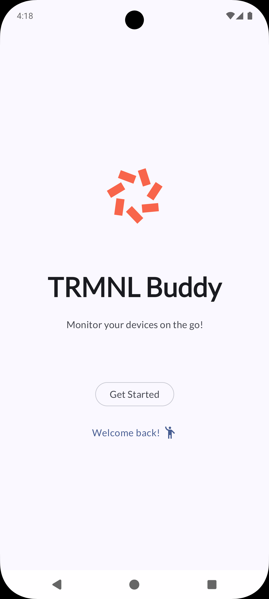
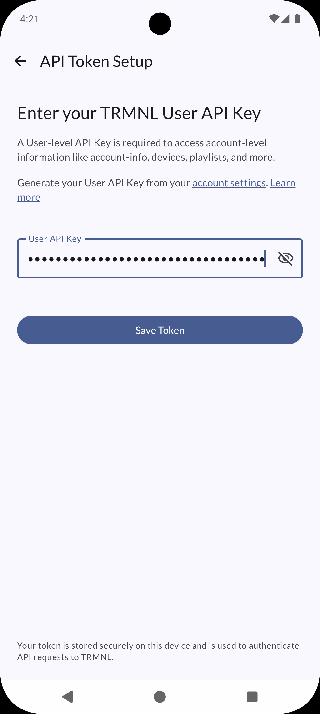
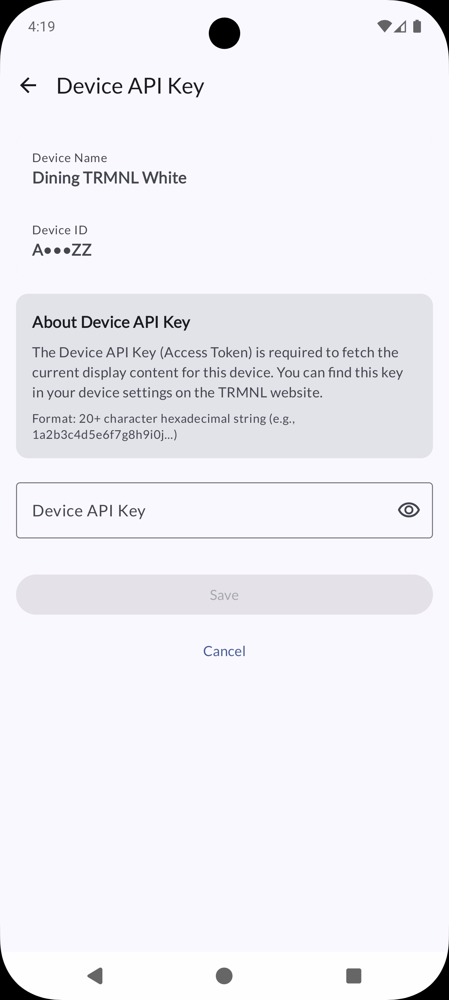
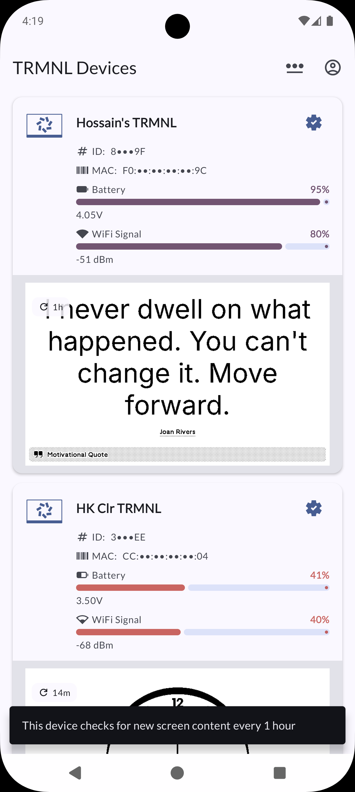
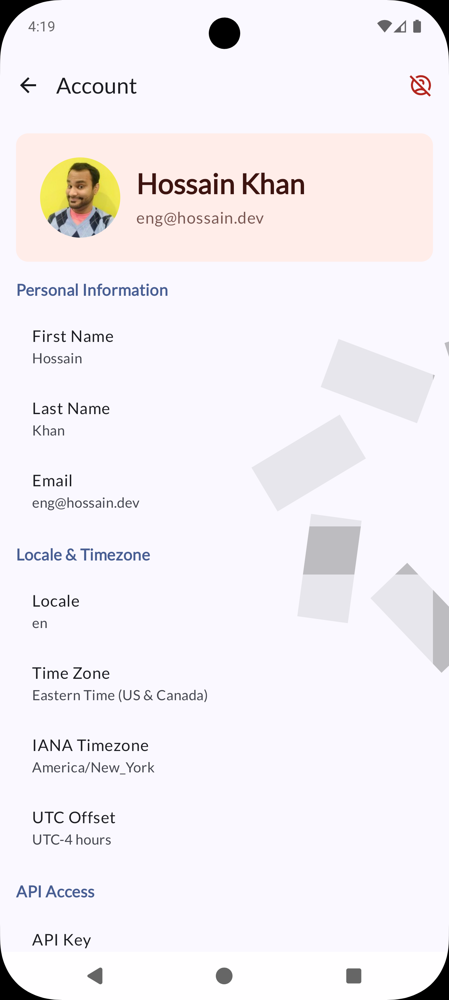
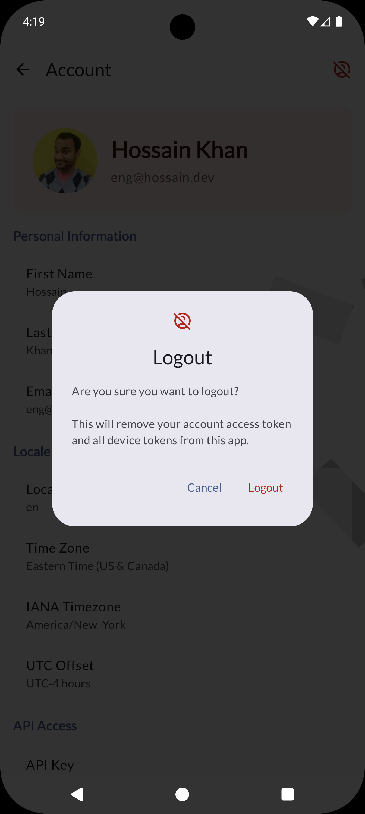

# TRMNL Buddy

Your companion app to monitor your TRMNLs on the go.

> 🚧 _NOTE: This is an experimental project, and it's current state not much can be done using the app except view device status remotely. Same thing can be done by visiting [usetrmnl.com/dashboard](https://usetrmnl.com/dashboard)._

An Android app built with:
- ⚡️ [Circuit](https://github.com/slackhq/circuit) for UI architecture
- 🏗️ [Metro](https://zacsweers.github.io/metro/) for Dependency Injection
- 🎨 [Jetpack Compose](https://developer.android.com/jetpack/compose) for UI
- 📱 Material Design 3 with 🌈 Material You!

## 🧪 Test Drive App
See [latest release](https://github.com/hossain-khan/trmnl-android-buddy/releases/latest) to download APK that you can side-load on your Android device. 

### 📸 Screenshots

<table>
  <tr>
    <td></td>
    <td></td>
    <td></td>
  </tr>
  <tr>
    <td></td>
    <td></td>
    <td></td>
  </tr>
</table>

## Getting Started

1. Open the project in Android Studio
2. Sync Gradle
3. Build and run! or just run `./gradlew assembleDebug` from command line to build APK.

