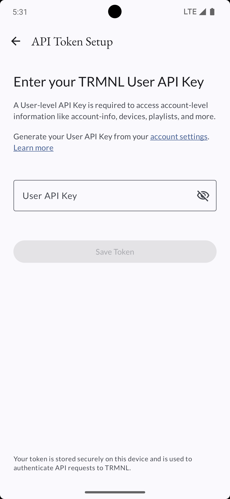
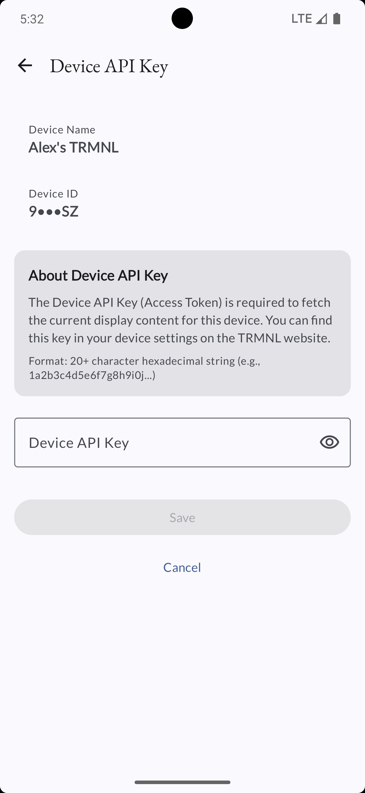
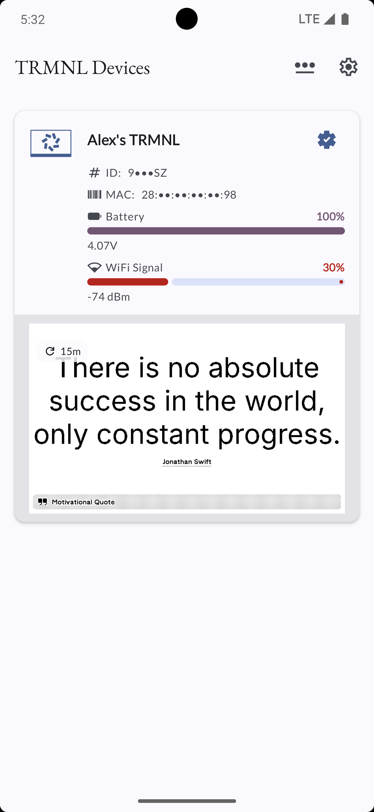
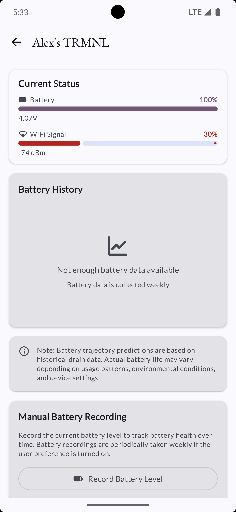

# TRMNL Buddy

Your companion app to monitor and manage your TRMNL e-ink displays on the go.

**TRMNL Android Buddy** is the essential companion app for managing your [TRMNL](https://usetrmnl.com) e-ink display devices. Monitor device health, track battery life over time, and stay on top of your displays' status—all from your Android phone.

## ✨ Features

- 📊 **Device Monitoring** - View all your TRMNL devices with real-time battery level and WiFi signal strength
- 🔋 **Battery Health Tracking** - Automatic weekly battery data collection with historical charts and trajectory visualization
- 📱 **Device Details** - Comprehensive information including voltage readings, signal strength, and device identifiers
- 🖼️ **Device Preview** - View current screen content for devices with configured device tokens
- 📰 **Content Feed** - Stay updated with announcements and blog posts from TRMNL
  - 📢 **Announcements** - Official TRMNL updates and news
  - 📝 **Blog Posts** - In-depth articles, tutorials, and platform updates with featured images
  - 🔄 **Automatic Sync** - Daily background sync to fetch new content
  - 📂 **Categories** - Filter blog posts by category (Tutorials, News, etc.)
  - ⭐ **Favorites** - Bookmark your favorite articles for later reading
  - 🔔 **Notifications** - Get notified when new blog posts are published
- 🎨 **Material You Design** - Dynamic theming support (Android 12+) with automatic dark mode
- 🔐 **Privacy-First** - Obfuscated display of sensitive information with toggle control
- ⚙️ **Customization** - Settings screen with battery tracking toggle and account management
- 📈 **Battery Insights** - Interactive line charts showing battery drain patterns over time

An Android app built with:
- ⚡️ [Circuit](https://github.com/slackhq/circuit) for UI architecture
- 🏗️ [Metro](https://zacsweers.github.io/metro/) for Dependency Injection
- 🎨 [Jetpack Compose](https://developer.android.com/jetpack/compose) for UI
- 📱 Material Design 3 with 🌈 Material You!

### 📸 Screenshots

<table>
  <tr>
    <td></td>
    <td></td>
    <td></td>
  </tr>
  <tr>
    <td></td>
    <td></td>
    <td></td>
  </tr>
</table>
