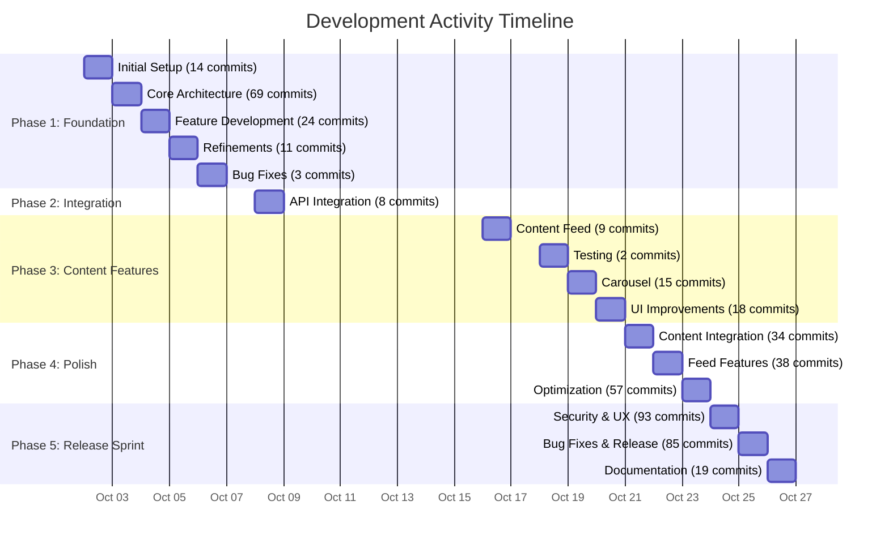
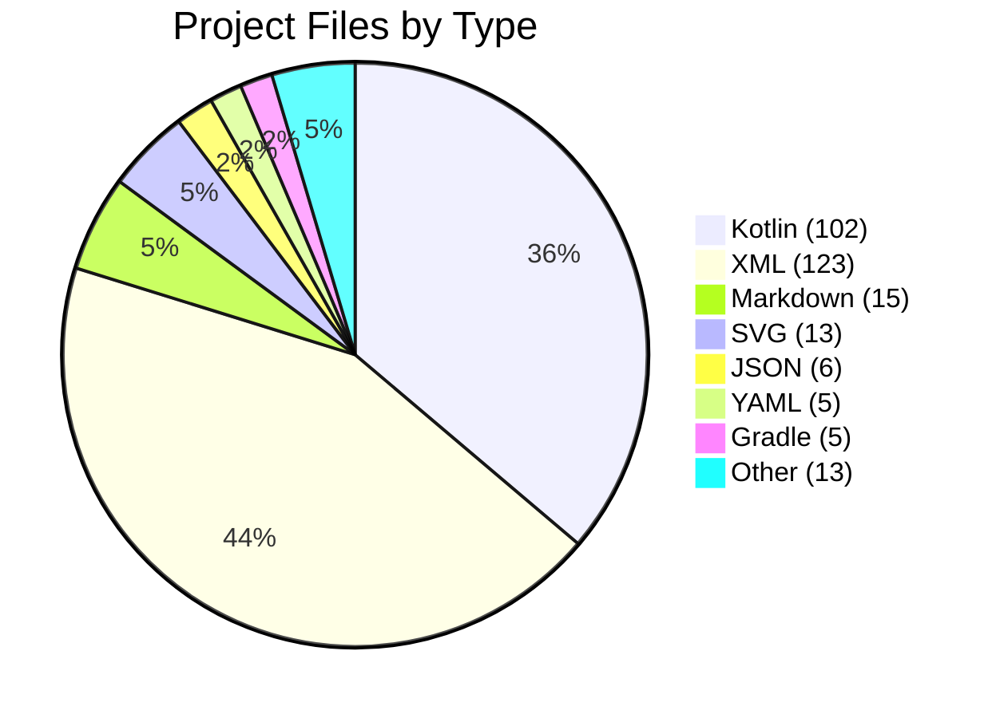
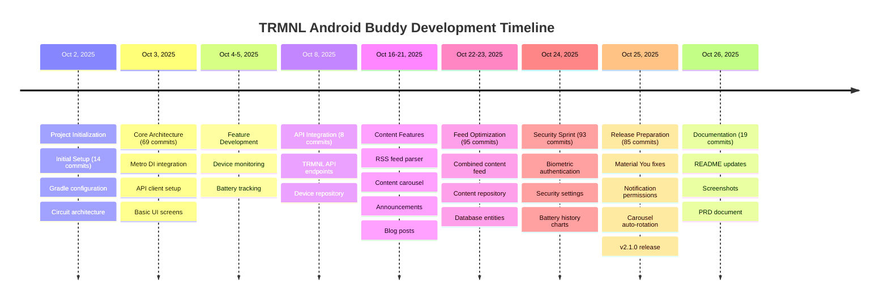

# TRMNL Android Buddy - Project Analysis

**Analysis Date**: October 26, 2025  
**Analysis Period**: October 2, 2025 - October 26, 2025 (25 days)

---

## 📊 Executive Summary

TRMNL Android Buddy is an actively developed Android companion app for TRMNL e-ink displays. The project has seen intensive development over a 25-day period with **559 total commits**, **103.48 hours** of estimated development time, and a clean, modern codebase built with Kotlin and Jetpack Compose.

### Key Metrics
- **Total Commits**: 559
- **Total Development Time**: ~103.5 hours
- **Active Days**: 16 out of 25 days (64%)
- **Development Sessions**: 26 sessions
- **Average Session Duration**: 3.98 hours
- **Contributors**: 2 (1 human developer + 1 AI assistant)

---

## ⏱️ Time Investment Analysis

### Methodology

Time estimation is based on git commit timestamp analysis with the following assumptions:

1. **Session Gap Threshold**: 3 hours
   - If time between commits ≤ 3 hours → same work session (accumulate time)
   - If time between commits > 3 hours → new work session (previous session ended)
2. **Session Duration**: Time from first commit to last commit in a continuous session
3. **Idle Time**: Not counted (gaps > 3 hours are considered breaks/offline)

This heuristic provides a conservative estimate of active development time, likely underestimating actual time spent on tasks like research, planning, testing, and UI design.

### Development Time Breakdown

| Metric | Value |
|--------|-------|
| Total Development Time | **103.48 hours** |
| Total Sessions | 26 |
| Average Session Duration | 3.98 hours |
| Longest Session | 19.38 hours (Oct 24) |
| Shortest Session | 0.01 hours (Oct 6) |

### Top 10 Longest Development Sessions

| Rank | Date | Duration | Time Range | Commits |
|------|------|----------|------------|---------|
| 1 | Oct 24, 2025 | 19.38 hrs | 07:00 - 02:22 | 93 |
| 2 | Oct 2, 2025 | 12.63 hrs | 11:21 - 23:59 | 14 |
| 3 | Oct 26, 2025 | 9.49 hrs | 08:35 - 18:05 | 19 |
| 4 | Oct 23, 2025 | 8.87 hrs | 17:35 - 02:27 | 57 |
| 5 | Oct 22, 2025 | 7.53 hrs | 19:37 - 03:09 | 38 |
| 6 | Oct 3, 2025 | 5.55 hrs | 07:42 - 13:15 | 34 |
| 7 | Oct 3, 2025 | 5.20 hrs | 18:33 - 23:45 | 35 |
| 8 | Oct 25, 2025 | 4.65 hrs | 18:33 - 23:12 | 44 |
| 9 | Oct 4, 2025 | 4.35 hrs | 06:58 - 11:19 | 24 |
| 10 | Oct 25, 2025 | 4.27 hrs | 07:50 - 12:06 | 41 |

### Daily Activity Distribution



### Commit Distribution

| Date | Commits | % of Total |
|------|---------|-----------|
| Oct 24, 2025 | 93 | 16.6% |
| Oct 25, 2025 | 85 | 15.2% |
| Oct 3, 2025 | 69 | 12.3% |
| Oct 23, 2025 | 57 | 10.2% |
| Oct 22, 2025 | 38 | 6.8% |
| Oct 21, 2025 | 34 | 6.1% |
| Oct 4, 2025 | 24 | 4.3% |
| Oct 26, 2025 | 19 | 3.4% |
| Oct 20, 2025 | 18 | 3.2% |
| Oct 19, 2025 | 15 | 2.7% |
| Others | 107 | 19.1% |

**Insight**: The project shows a classic sprint pattern with intensive development bursts (Oct 24-26 and Oct 3), likely corresponding to major feature implementations and release preparation.

---

## 📁 Project Structure & File Analysis

### Codebase Statistics

Generated using `cloc` (Count Lines of Code):

| Language | Files | Blank Lines | Comments | Code | Total Lines |
|----------|-------|-------------|----------|------|-------------|
| **Kotlin** | 102 | 1,770 | 2,956 | 15,565 | 20,291 |
| **Markdown** | 15 | 1,163 | 0 | 4,720 | 5,883 |
| **XML** | 123 | 171 | 53 | 3,295 | 3,519 |
| **YAML** | 5 | 103 | 66 | 1,394 | 1,563 |
| **JSON** | 6 | 0 | 0 | 792 | 792 |
| **Gradle** | 5 | 63 | 61 | 267 | 391 |
| **SVG** | 13 | 0 | 1 | 145 | 146 |
| **Other** | 13 | 108 | 257 | 336 | 701 |
| **TOTAL** | **282** | **3,378** | **3,394** | **26,514** | **33,286** |

### Code Quality Metrics

- **Comment Density**: 12.8% (3,394 comments / 26,514 code lines)
- **Kotlin Focus**: 58.7% of total code (15,565 / 26,514)
- **Documentation**: Extensive with 4,720 lines of Markdown
- **XML Resources**: 123 files for Android UI/resources

### File Type Distribution



### Key Directories

```
trmnl-android-buddy/
├── app/                          # Main Android application (102 .kt files)
│   ├── src/main/                 # Production code
│   │   ├── java/ink/trmnl/android/buddy/
│   │   │   ├── ui/               # Jetpack Compose UI screens
│   │   │   ├── data/             # Repositories, DAOs, entities
│   │   │   ├── di/               # Dependency injection
│   │   │   ├── security/         # Biometric authentication
│   │   │   ├── util/             # Utility functions
│   │   │   └── work/             # Background workers
│   │   └── res/                  # Android resources (123 XML files)
│   └── src/test/                 # Unit tests (14 .kt test files)
├── api/                          # TRMNL API integration module
│   └── src/
│       ├── main/                 # API client, models, repositories
│       └── test/                 # API tests with MockWebServer
├── content/                      # Content feed module (RSS, announcements, blogs)
│   └── src/
│       ├── main/                 # Content repositories, DAOs
│       └── test/                 # Content module tests
├── docs/                         # Project documentation (Markdown)
├── gradle/                       # Gradle configuration & dependency versions
├── keystore/                     # Debug keystore & signing documentation
└── project-resources/            # Screenshots, icons, graphics (SVG, PNG)
```

---

## 👥 Contributor Analysis

### Contributors

| Contributor | Commits | Percentage | Type |
|-------------|---------|------------|------|
| Hossain Khan | 493 | 88.2% | Human Developer |
| copilot-swe-agent[bot] | 65 | 11.6% | AI Assistant |
| **copilot-swe-agent[bot]** | 1 | 0.2% | Bot (merge) |

### Development Pattern

The project demonstrates a **hybrid development approach**:
- **Primary Development**: Human developer (Hossain Khan) handles architecture, critical features, and final implementation
- **AI-Assisted Development**: GitHub Copilot assists with code generation, refactoring, and documentation (65 commits)
- **Collaboration**: Human reviews and integrates AI suggestions, maintaining code quality

---

## 🚀 Development Milestones

### Version History

| Version | Date | Major Features |
|---------|------|----------------|
| **2.1.0** | Oct 26, 2025 | Security (biometric auth), Settings UI improvements, Material You compliance |
| **2.0.0** | Oct 25, 2025 | Combined content carousel, Background sync optimization |
| **1.7.0** | Oct 24, 2025 | Battery history tracking with charts |
| **1.6.0** | Oct 23, 2025 | RSS feed content integration |
| **1.5.0** | Oct 22, 2025 | Content feed repository architecture |
| Earlier | Oct 2-21 | Foundation, API integration, core features |

### Timeline Graph



---

## 📈 Insights & Patterns

### 1. Development Velocity

**High-Intensity Sprints**:
- The project shows clear sprint patterns with peak activity days:
  - **Oct 24**: 93 commits (Security & UX sprint)
  - **Oct 25**: 85 commits (Release preparation)
  - **Oct 3**: 69 commits (Core architecture)

**Sustainable Pace**:
- 16 active development days over 25-day period
- Average of 35 commits per active day
- Average session duration of ~4 hours

### 2. Code Quality Indicators

**Positive Signals**:
- ✅ **High Comment Density**: 12.8% indicates well-documented code
- ✅ **Test Coverage**: 14 dedicated test files
- ✅ **Modular Architecture**: Separate modules (app, api, content)
- ✅ **Modern Stack**: Kotlin, Compose, Circuit, Metro DI
- ✅ **Type Safety**: EitherNet for API error handling

**Technical Debt Management**:
- Regular refactoring commits (split screens, modularization)
- Code review via PRs (182+ pull requests)
- CI/CD with GitHub Actions

### 3. Feature Development Pattern

**Iterative Approach**:
1. **Foundation** (Oct 2-5): Core architecture, API integration
2. **Features** (Oct 8-21): Device monitoring, content feeds
3. **Polish** (Oct 22-25): UI improvements, security, optimization
4. **Release** (Oct 25-26): v2.1.0 release, documentation

**Material You Compliance**:
- Recent focus on Material 3 design system
- Dynamic color theming support
- Theme-aware components

### 4. Technology Choices

**Modern Android Stack**:
- **UI**: Jetpack Compose (declarative UI)
- **Architecture**: Circuit (Slack's UDF architecture)
- **DI**: Metro with KSP (compile-time safety)
- **Network**: Retrofit 3.0 + OkHttp 5.1 + EitherNet
- **Async**: Kotlinx Coroutines
- **Storage**: Room + DataStore

**Benefits**:
- Type-safe navigation and state management
- Compile-time dependency injection
- Modern, maintainable codebase

### 5. AI-Assisted Development

**Copilot Integration** (65 commits):
- Code generation and refactoring
- Documentation (PRD, analysis)
- UI component splitting
- Consistent with modern development practices

**Impact**:
- Accelerated development velocity
- Consistent code patterns
- Comprehensive documentation

### 6. Release Cadence

**Rapid Iteration**:
- v1.0.0 to v2.1.0 in 25 days
- 10+ minor/major versions
- Semantic versioning followed
- Detailed CHANGELOG.md maintenance

---

## 🎯 Key Achievements

### Technical
1. ✅ **Modern Architecture**: Circuit + Metro + Compose
2. ✅ **Modular Design**: Separate API and content modules
3. ✅ **Type Safety**: EitherNet for API results, sealed classes
4. ✅ **Testing**: Unit tests with MockWebServer, fakes, Circuit test utilities
5. ✅ **Material You**: Full compliance with Material 3 design system

### Features
1. ✅ **Device Monitoring**: Real-time battery and WiFi tracking
2. ✅ **Battery History**: Charts with weekly data collection
3. ✅ **Content Feed**: Combined announcements & blog posts
4. ✅ **Security**: Biometric/credential authentication
5. ✅ **Background Sync**: Optimized workers with constraints

### User Experience
1. ✅ **Dynamic Theming**: Material You with wallpaper-based colors
2. ✅ **Dark Mode**: Full support with proper theme colors
3. ✅ **Privacy**: Obfuscated sensitive data with toggle
4. ✅ **Accessibility**: Proper content descriptions, semantic markup

---

## 📊 Statistical Summary

### Code Metrics
- **Total Lines**: 33,286
- **Production Code**: 15,565 lines (Kotlin)
- **Documentation**: 4,720 lines (Markdown)
- **Resources**: 3,295 lines (XML)
- **Files**: 282 files

### Development Metrics
- **Duration**: 25 days
- **Active Days**: 16 days (64%)
- **Total Commits**: 559
- **Development Time**: 103.48 hours
- **Average Daily Commits**: 35 (on active days)
- **Peak Day**: 93 commits (Oct 24)

### Quality Metrics
- **Comment Ratio**: 12.8%
- **Test Files**: 14 files
- **Modules**: 3 (app, api, content)
- **CI/CD**: GitHub Actions (passing)

---

## 🔮 Observations & Recommendations

### Strengths
1. **Rapid Development**: High velocity without compromising quality
2. **Modern Stack**: Using latest Android best practices
3. **Documentation**: Comprehensive CHANGELOG and README
4. **Testing**: Unit tests for critical components
5. **AI Integration**: Effective use of Copilot for productivity

### Potential Areas for Enhancement
1. **UI Testing**: Consider adding Compose UI tests
2. **Integration Tests**: End-to-end testing for critical flows
3. **Performance Monitoring**: Firebase Performance or similar
4. **Analytics**: User behavior tracking (privacy-respecting)
5. **Crash Reporting**: Firebase Crashlytics or Sentry

### Development Process Excellence
1. **PR-Based Workflow**: All changes via pull requests
2. **Semantic Versioning**: Consistent version numbering
3. **CHANGELOG**: Well-maintained release notes
4. **Code Review**: Human + AI collaboration
5. **Quality Gates**: Format, lint, test before commit

---

## 📝 Conclusion

TRMNL Android Buddy represents a modern, well-architected Android application developed with impressive velocity and quality. The project demonstrates:

- **Professional Development Practices**: PR-based workflow, CI/CD, semantic versioning
- **Modern Architecture**: Circuit, Metro DI, Jetpack Compose
- **Rapid Iteration**: 559 commits over 25 days (~103.5 hours)
- **Quality Focus**: 12.8% comment density, comprehensive documentation
- **Innovative Approach**: Human + AI collaboration for accelerated development

The project is actively maintained, well-documented, and follows Android best practices. The hybrid development approach with AI assistance has proven effective in maintaining high velocity while preserving code quality.

---

**Generated**: October 26, 2025  
**Analysis Tool**: Git log analysis + cloc  
**Methodology**: 3-hour gap heuristic for time estimation  
**Data Source**: Git repository history (Oct 2 - Oct 26, 2025)
