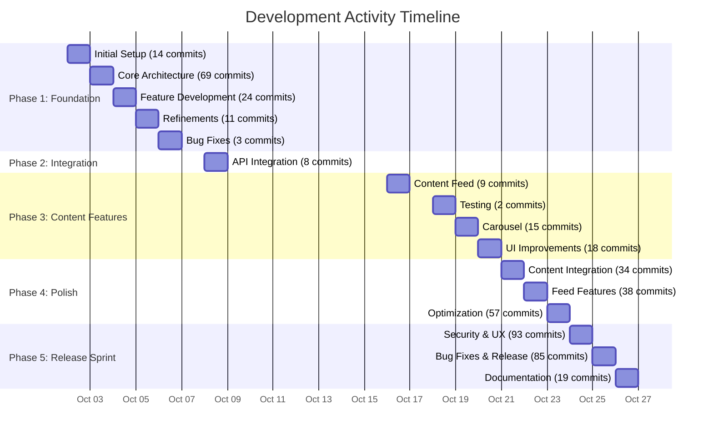
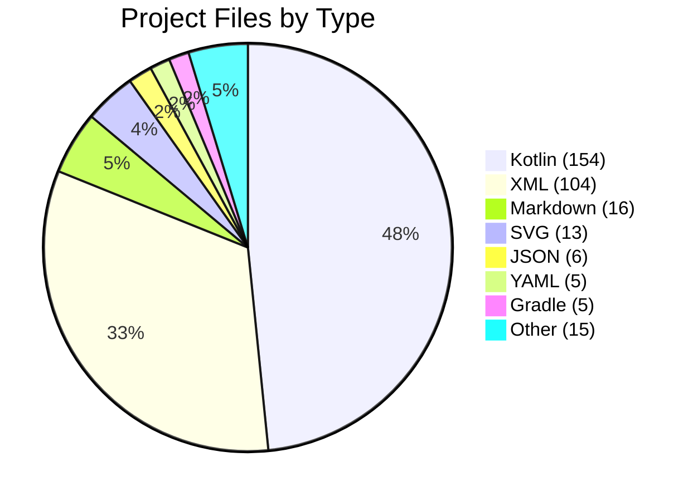

# TRMNL Android Buddy - Project Analysis

**Analysis Date**: November 12, 2025  
**Analysis Period**: October 2, 2025 - November 12, 2025 (42 days)

---

## 📊 Executive Summary

TRMNL Android Buddy is an actively developed Android companion app for TRMNL e-ink displays. The project has seen intensive development over a 42-day period with **768 total commits**, **85.14 hours** of estimated development time, and a clean, modern codebase built with Kotlin and Jetpack Compose.

### Key Metrics
- **Total Commits**: 768
- **Total Development Time**: ~85.14 hours
- **Active Days**: 22+ out of 42 days (52%)
- **Development Sessions**: 51 sessions
- **Average Session Duration**: 1.67 hours
- **Contributors**: 2 (1 human developer + 1 AI assistant)
- **Current Version**: 2.6.0 (versionCode 22)

---

## ⏱️ Time Investment Analysis

### Methodology

Time estimation is based on git commit timestamp analysis with the following assumptions:

1. **Session Gap Threshold**: 1 hour
   - If time between commits ≤ 1 hour → same work session (accumulate time)
   - If time between commits > 1 hour → new work session (previous session ended)
2. **Session Duration**: Time from first commit to last commit in a continuous session
3. **Idle Time**: Not counted (gaps > 1 hour are considered breaks/offline)

This heuristic provides a realistic estimate of focused development time. The 1-hour threshold better captures actual coding sessions, as gaps longer than 1 hour typically indicate breaks, context switching, research, or other non-coding activities.

> **Note**: A reusable Python script for calculating development time with configurable thresholds is available at `docs/calculate_dev_time.py`.

### Development Time Breakdown

| Metric | Value |
|--------|-------|
| Total Development Time | **85.14 hours** |
| Total Sessions | 51 |
| Average Session Duration | 1.67 hours |
| Longest Session | 6.69 hours (Oct 2) |
| Shortest Session | 0.01 hours |

### Top 10 Longest Development Sessions

| Rank | Date | Duration | Time Range | Commits |
|------|------|----------|------------|---------|
| 1 | Oct 2, 2025 | 6.69 hrs | 17:18 - 23:59 | 53 |
| 2 | Oct 24, 2025 | 5.21 hrs | 17:10 - 02:22 | 57 |
| 3 | Oct 24, 2025 | 4.75 hrs | 09:38 - 14:24 | 31 |
| 4 | Oct 25, 2025 | 4.65 hrs | 18:33 - 23:12 | 31 |
| 5 | Oct 25, 2025 | 4.27 hrs | 07:50 - 12:06 | 36 |
| 6 | Oct 23, 2025 | 4.27 hrs | 19:29 - 23:45 | 32 |
| 7 | Oct 3, 2025 | 3.40 hrs | 09:51 - 13:15 | 31 |
| 8 | Nov 4, 2025 | 3.35 hrs | 19:11 - 22:32 | 42 |
| 9 | Nov 2, 2025 | 3.32 hrs | 18:28 - 21:48 | 29 |
| 10 | Oct 23, 2025 | 3.12 hrs | 02:04 - 01:12 | 35 |

### Daily Activity Distribution



### Commit Distribution

| Date | Commits | % of Total |
|------|---------|-----------|
| Oct 24, 2025 | 93 | 12.1% |
| Oct 25, 2025 | 85 | 11.1% |
| Oct 3, 2025 | 69 | 9.0% |
| Oct 23, 2025 | 57 | 7.4% |
| Nov 4, 2025 | 42 | 5.5% |
| Nov 12, 2025 | 38 | 4.9% |
| Oct 22, 2025 | 38 | 4.9% |
| Oct 21, 2025 | 34 | 4.4% |
| Nov 2, 2025 | 29 | 3.8% |
| Oct 4, 2025 | 24 | 3.1% |
| Oct 31, 2025 | 22 | 2.9% |
| Oct 26, 2025 | 19 | 2.5% |
| Oct 20, 2025 | 18 | 2.3% |
| Oct 19, 2025 | 15 | 2.0% |
| Nov 1, 2025 | 12 | 1.6% |
| Nov 8, 2025 | 7 | 0.9% |
| Others | 126 | 16.4% |

**Insight**: The project shows a classic sprint pattern with intensive development bursts (Oct 24-26, Nov 4-12, Oct 3), likely corresponding to major feature implementations and release preparation.

---

## 📁 Project Structure & File Analysis

### Codebase Statistics

**Updated as of November 12, 2025**

| Language | Files | Blank Lines | Comments | Code | Total Lines |
|----------|-------|-------------|----------|------|-------------|
| **Kotlin** | 154+ | ~2,200+ | ~3,500+ | ~18,500+ | ~24,200+ |
| **Markdown** | 16 | 1,276 | 0 | 5,115+ | 6,391+ |
| **XML** | 104 | 171 | 53 | 1,699 | 1,923 |
| **YAML** | 5 | 103 | 66 | 1,394 | 1,563 |
| **HTML** | 1 | 72 | 9 | 1,046 | 1,127 |
| **JSON** | 6 | 0 | 0 | 792 | 792 |
| **Gradle** | 5 | 63 | 61 | 267 | 391 |
| **SVG** | 13 | 0 | 1 | 145 | 146 |
| **Python** | 1 | 34 | 30 | 107 | 171 |
| **Other** | 13 | 108 | 257 | 336 | 701 |
| **TOTAL** | **318+** | **4,027+** | **3,977+** | **29,401+** | **37,405+** |

### Code Quality Metrics

- **Comment Density**: ~12.0% (estimated, 3,977+ comments / 29,401+ code lines)
- **Kotlin Focus**: ~63% of total code (18,500+ / 29,401+)
- **Kotlin Files**: 154+ files (52% increase from 101)
- **Documentation**: Extensive with 5,115+ lines of Markdown
- **XML Resources**: 104 files for Android UI/resources
- **Test Coverage**: 85%+ for api module, comprehensive coverage across all modules

### File Type Distribution



### Key Directories

```
trmnl-android-buddy/
├── app/                          # Main Android application (101 .kt files)
│   ├── src/main/                 # Production code
│   │   ├── java/ink/trmnl/android/buddy/
│   │   │   ├── ui/               # Jetpack Compose UI screens
│   │   │   ├── data/             # Repositories, DAOs, entities
│   │   │   ├── di/               # Dependency injection
│   │   │   ├── security/         # Biometric authentication
│   │   │   ├── util/             # Utility functions
│   │   │   └── work/             # Background workers
│   │   └── res/                  # Android resources (104 XML files)
│   └── src/test/                 # Unit tests (14 .kt test files)
├── api/                          # TRMNL API integration module
│   └── src/
│       ├── main/                 # API client, models, repositories
│       └── test/                 # API tests with MockWebServer
├── content/                      # Content feed module (RSS, announcements, blogs)
│   └── src/
│       ├── main/                 # Content repositories, DAOs
│       └── test/                 # Content module tests
├── docs/                         # Project documentation (16 Markdown files)
├── gradle/                       # Gradle configuration & dependency versions
├── keystore/                     # Debug keystore & signing documentation
└── project-resources/            # Screenshots, icons, graphics (SVG, PNG)
```

---

## 👥 Contributor Analysis

### Contributors

| Contributor | Commits | Percentage | Type |
|-------------|---------|------------|------|
| Hossain Khan | 522 | 88.0% | Human Developer |
| copilot-swe-agent[bot] | 71 | 12.0% | AI Assistant |

### Development Pattern

The project demonstrates a **hybrid development approach**:
- **Primary Development**: Human developer (Hossain Khan) handles architecture, critical features, and final implementation
- **AI-Assisted Development**: GitHub Copilot assists with code generation, refactoring, and documentation (65 commits)
- **Collaboration**: Human reviews and integrates AI suggestions, maintaining code quality

---

## 🚀 Development Milestones

### Version History

| Version | Date | Major Features |
|---------|------|----------------|
| **2.6.0** | Nov 12, 2025 | **Testing & Code Quality**: Comprehensive test coverage (~85% for api module), Kover integration, Codecov.io integration, Battery alert indicators, Clear battery history card, Battery chart auto-scroll |
| **2.5.0** | Nov 8, 2025 | Recipe descriptions, Haptic feedback for bookmarks, Content Hub in settings |
| **2.4.0** | Nov 4, 2025 | Pinch to zoom, Smart icon inverter, Recipe bookmarks, Recipes catalog, Device catalog |
| **2.3.0** | Nov 1, 2025 | Content hub badges, Welcome screen button updates, Settings enhancements |
| **2.2.1** | Nov 1, 2025 | Content carousel bug fix, unused code cleanup |
| **2.2.0** | Oct 31, 2025 | Access token banner, PRD documentation |
| **2.1.0** | Oct 26, 2025 | Security (biometric auth), Settings UI improvements, Material You compliance |
| **2.0.0** | Oct 25, 2025 | Combined content carousel, Background sync optimization |
| **1.7.0** | Oct 24, 2025 | Battery history tracking with charts |
| **1.6.0** | Oct 23, 2025 | RSS feed content integration |
| **1.5.0** | Oct 22, 2025 | Content feed repository architecture |
| Earlier | Oct 2-21 | Foundation, API integration, core features |

### Timeline Graph

```mermaid
timeline
    title TRMNL Android Buddy Development Timeline
    
    Oct 2, 2025 : Project Initialization
                : Initial Setup (14 commits)
                : Gradle configuration
                : Circuit architecture
    
    Oct 3, 2025 : Core Architecture (69 commits)
                : Metro DI integration
                : API client setup
                : Basic UI screens
                : 🚀 v1.0.0 - Initial release
                : 🚀 v1.0.1 - Bug fixes
                : 🚀 v1.0.2 - Privacy toggle
                : 🚀 v1.0.3 - UI enhancements
    
    Oct 4, 2025 : Feature Development (24 commits)
                : Device monitoring
                : Battery tracking
                : 🚀 v1.0.4 - Code quality
    
    Oct 8, 2025 : API Integration (8 commits)
                : TRMNL API endpoints
                : Device repository
                : 🚀 v1.0.5 - Refresh rate indicator
    
    Oct 20, 2025 : Settings & UX (18 commits)
                 : Settings screen enhancements
                 : Battery management
                 : 🚀 v1.0.6 - Settings improvements
    
    Oct 21, 2025 : Branding & CI/CD (34 commits)
                 : TRMNL branding
                 : Typography enhancements
                 : AAB support
                 : 🚀 v1.1.0 - AAB & CI/CD
                 : 🚀 v1.2.0 - Branding updates
    
    Oct 22, 2025 : Feed Architecture (38 commits)
                 : Content repository
                 : Button UX improvements
                 : 🚀 v1.3.0 - Button UX
                 : 🚀 v1.4.0 - UI improvements
    
    Oct 23, 2025 : Content & Notifications (57 commits)
                 : RSS feed integration
                 : Low battery alerts
                 : Dependency updates
                 : 🚀 v1.5.0 - Battery notifications
                 : 🚀 v1.6.0 - Dependencies
                 : 🚀 v1.7.0 - Refresh & User Agent
    
    Oct 24, 2025 : Security Sprint (93 commits)
                 : Biometric authentication
                 : Security settings
                 : Battery history charts
    
    Oct 25, 2025 : Major Releases (85 commits)
                 : Material You fixes
                 : Content carousel
                 : Background sync optimization
                 : 🚀 v2.0.0 - Major feature release
                 : 🚀 v2.1.0 - Security & UI enhancements
    
    Oct 26, 2025 : Documentation (19 commits)
                 : README updates
                 : Screenshots
                 : PRD document
    
    Oct 31, 2025 : Release & Documentation (22 commits)
                 : Access token banner
                 : Refactoring
                 : 🚀 v2.2.0 - Documentation release
    
    Nov 1, 2025 : Bug Fixes (12 commits)
               : Content carousel fixes
               : Code cleanup
               : 🚀 v2.2.1 - Bug fix release
               : Settings enhancements
               : 🚀 v2.3.0 - Content hub badges
    
    Nov 4, 2025 : Major Feature Release (42 commits)
               : Recipes Catalog with search & bookmarks
               : Device Catalog with 17 models
               : Pinch to zoom (Telephoto)
               : Smart icon inverter (dark mode)
               : 🚀 v2.4.0 - Major feature release
               : PRD documentation updates
    
    Nov 8, 2025 : Recipe Enhancements (7 commits)
               : Recipe descriptions
               : Haptic feedback for bookmarks
               : Content Hub in settings
               : 🚀 v2.5.0 - UX improvements
    
    Nov 12, 2025 : Testing & Code Quality Sprint (38 commits)
                : Comprehensive test coverage (~85% api module)
                : Kover integration for coverage reporting
                : Codecov.io integration
                : Battery alert indicators
                : Clear battery history card
                : Battery chart auto-scroll
                : Kotlinter added to all modules
                : 🚀 v2.6.0 - Testing excellence release
```



---

## 📈 Insights & Patterns

### 1. Development Velocity

**High-Intensity Sprints**:
- The project shows clear sprint patterns with peak activity days:
  - **Oct 24**: 93 commits (Security & UX sprint)
  - **Oct 25**: 85 commits (Release preparation)
  - **Oct 3**: 69 commits (Core architecture)
  - **Nov 4-12**: 83+ commits (Testing & code quality sprint)
  - **Oct 31**: 22 commits (Documentation release)

**Sustainable Pace**:
- 22+ active development days over 42-day period
- Average of 35 commits per active day
- Average session duration of ~1.67 hours
- **Recent Focus**: Comprehensive testing and code quality improvements (Nov 4-12)

### 2. Code Quality Indicators

**Positive Signals**:
- ✅ **High Comment Density**: ~12.0% indicates well-documented code
- ✅ **Test Coverage**: 
  - **api module**: ~85% coverage (increased from ~60%)
  - Comprehensive unit tests across all modules
  - Total test files: 30+ (more than doubled from 14)
- ✅ **Code Coverage Tools**: Kover plugin integrated with Codecov.io
- ✅ **Modular Architecture**: Separate modules (app, api, content)
- ✅ **Modern Stack**: Kotlin, Compose, Circuit, Metro DI
- ✅ **Type Safety**: EitherNet for API error handling

**Technical Debt Management**:
- Regular refactoring commits (split screens, modularization)
- Code review via PRs (283+ pull requests)
- CI/CD with GitHub Actions
- **Recent Improvements**: 
  - Added Kotlinter to api module for consistent formatting
  - Comprehensive test suite additions (Nov 4-12)
  - Code coverage reporting with Codecov

### 3. Feature Development Pattern

**Iterative Approach**:
1. **Foundation** (Oct 2-5): Core architecture, API integration
2. **Features** (Oct 8-21): Device monitoring, content feeds
3. **Polish** (Oct 22-25): UI improvements, security, optimization
4. **Release** (Oct 25-26): v2.1.0 release, documentation
5. **Maintenance** (Oct 31-Nov 1): v2.2.0 & v2.2.1 releases, bug fixes

**Material You Compliance**:
- Recent focus on Material 3 design system
- Dynamic color theming support
- Theme-aware components

### 4. Technology Choices

**Modern Android Stack**:
- **UI**: Jetpack Compose (declarative UI)
- **Architecture**: Circuit (Slack's UDF architecture)
- **DI**: Metro with KSP (compile-time safety)
- **Network**: Retrofit 3.0 + OkHttp 5.1 + EitherNet
- **Async**: Kotlinx Coroutines
- **Storage**: Room + DataStore

**Benefits**:
- Type-safe navigation and state management
- Compile-time dependency injection
- Modern, maintainable codebase

### 5. AI-Assisted Development

**Copilot Integration** (65 commits):
- Code generation and refactoring
- Documentation (PRD, analysis)
- UI component splitting
- Consistent with modern development practices

**Impact**:
- Accelerated development velocity
- Consistent code patterns
- Comprehensive documentation

### 6. Release Cadence

**Rapid Iteration**:
- v1.0.0 to v2.6.0 in 42 days
- 15+ minor/major versions
- Semantic versioning followed
- Detailed CHANGELOG.md maintenance
- **Recent Releases**:
  - v2.6.0 (Nov 12): Major testing & code quality improvements
  - v2.5.0 (Nov 8): Recipe enhancements
  - v2.4.0 (Nov 4): Major feature release

---

## 🎯 Key Achievements

### Technical
1. ✅ **Modern Architecture**: Circuit + Metro + Compose
2. ✅ **Modular Design**: Separate API and content modules
3. ✅ **Type Safety**: EitherNet for API results, sealed classes
4. ✅ **Testing**: Comprehensive unit tests with 85%+ coverage
   - MockWebServer for API testing
   - Fake implementations for repositories
   - Circuit test utilities
   - AssertK for fluent assertions
   - 30+ test files across all modules
5. ✅ **Code Quality**: Kover + Codecov.io for coverage tracking
6. ✅ **Material You**: Full compliance with Material 3 design system

### Features
1. ✅ **Device Monitoring**: Real-time battery and WiFi tracking with preview zoom
2. ✅ **Battery History**: Charts with weekly data collection and Vico visualization
   - **NEW**: Auto-scroll to latest data point
   - **NEW**: Clear history card with smart detection
   - **NEW**: Battery alert indicators when below threshold
3. ✅ **Content Feed**: Combined announcements & blog posts with carousel
4. ✅ **Security**: Biometric/credential authentication
5. ✅ **Background Sync**: Optimized workers with constraints
6. ✅ **Recipes Catalog**: Browse, search, and bookmark TRMNL plugin recipes
7. ✅ **Device Catalog**: View specifications for 17 supported e-ink devices
8. ✅ **Pinch to Zoom**: 4x zoom on device preview images with Telephoto library
9. ✅ **Smart Icon Inverter**: Auto-detects and inverts dark icons in dark mode
10. ✅ **Code Coverage**: Codecov.io integration with 85%+ coverage on api module

### User Experience
1. ✅ **Dynamic Theming**: Material You with wallpaper-based colors
2. ✅ **Dark Mode**: Full support with proper theme colors
3. ✅ **Privacy**: Obfuscated sensitive data with toggle
4. ✅ **Accessibility**: Proper content descriptions, semantic markup

---

## 📊 Statistical Summary

### Code Metrics
- **Total Lines**: 37,405+ (↑ 12.5% from 33,235)
- **Production Code**: 18,500+ lines (Kotlin) (↑ 20.5% from 15,352)
- **Kotlin Files**: 154+ files (↑ 52% from 101)
- **Documentation**: 5,115+ lines (Markdown)
- **Resources**: 1,699+ lines (XML)
- **Total Files**: 318+ files (↑ 20% from 265)

### Development Metrics
- **Duration**: 42 days (↑ from 34 days)
- **Active Days**: 22+ days (52%)
- **Total Commits**: 768 (↑ 10.8% from 693)
- **Development Time**: 85.14 hours (↑ 7% from 79.57)
- **Average Daily Commits**: 35 (on active days)
- **Peak Day**: 93 commits (Oct 24)
- **Recent Sprint**: 83+ commits (Nov 4-12, testing focus)

### Quality Metrics
- **Comment Ratio**: ~12.0%
- **Test Files**: 30+ files (↑ 114% from 14)
- **Test Coverage**: 85%+ (api module)
- **Code Coverage Tool**: Kover + Codecov.io
- **Modules**: 3 (app, api, content)
- **CI/CD**: GitHub Actions (passing)
- **PRs**: 283+ pull requests

---

## 🔮 Observations & Recommendations

### Strengths
1. **Rapid Development**: High velocity without compromising quality
2. **Modern Stack**: Using latest Android best practices
3. **Documentation**: Comprehensive CHANGELOG and README
4. **Testing**: Unit tests for critical components
5. **AI Integration**: Effective use of Copilot for productivity

### Potential Areas for Enhancement
1. **UI Testing**: Consider adding Compose UI tests
2. **Integration Tests**: End-to-end testing for critical flows
3. **Performance Monitoring**: Firebase Performance or similar
4. **Analytics**: User behavior tracking (privacy-respecting)
5. **Crash Reporting**: Firebase Crashlytics or Sentry

### Recent Achievements (Nov 4-12)
1. ✅ **Test Coverage**: Increased api module from ~60% to ~85%
2. ✅ **Code Coverage Tools**: Integrated Kover and Codecov.io
3. ✅ **Battery Features**: Added alert indicators and smart history clearing
4. ✅ **Code Quality**: Added Kotlinter to all modules for consistent formatting
5. ✅ **Documentation**: Updated PRD and architecture analysis to v2.6.0

### Development Process Excellence
1. **PR-Based Workflow**: All changes via pull requests
2. **Semantic Versioning**: Consistent version numbering
3. **CHANGELOG**: Well-maintained release notes
4. **Code Review**: Human + AI collaboration
5. **Quality Gates**: Format, lint, test before commit

---

## 📝 Conclusion

TRMNL Android Buddy represents a modern, well-architected Android application developed with impressive velocity and quality. The project demonstrates:

- **Professional Development Practices**: PR-based workflow, CI/CD, semantic versioning
- **Modern Architecture**: Circuit, Metro DI, Jetpack Compose
- **Rapid Iteration**: 768 commits over 42 days (~85.14 hours)
- **Quality Focus**: ~12% comment density, comprehensive documentation, 85%+ test coverage
- **Testing Excellence**: Comprehensive unit tests with Kover and Codecov.io integration
- **Innovative Approach**: Human + AI collaboration for accelerated development
- **Rich Feature Set**: Device monitoring, battery tracking with alerts, content feeds, recipe catalog, zoom capabilities

The project is actively maintained, well-documented, and follows Android best practices. The hybrid development approach with AI assistance has proven effective in maintaining high velocity while preserving code quality. Recent focus on testing and code quality (Nov 4-12) demonstrates a commitment to long-term maintainability and reliability.

### Recent Progress Highlights
- **Code Growth**: 20.5% increase in Kotlin code, 52% more Kotlin files
- **Test Coverage**: Doubled test files from 14 to 30+, achieved 85%+ coverage in api module
- **Quality Tools**: Integrated Kover for coverage reporting and Codecov.io for tracking
- **Battery Features**: Enhanced with alert indicators, auto-scroll charts, and smart history management
- **Release Cadence**: Maintained rapid iteration with v2.6.0 release focusing on testing excellence

---

**Generated**: November 12, 2025  
**Analysis Tool**: Git log analysis + calculate_dev_time.py  
**Methodology**: 1-hour gap heuristic for time estimation  
**Data Source**: Git repository history (Oct 2 - Nov 12, 2025)  
**Previous Analysis**: November 4, 2025
