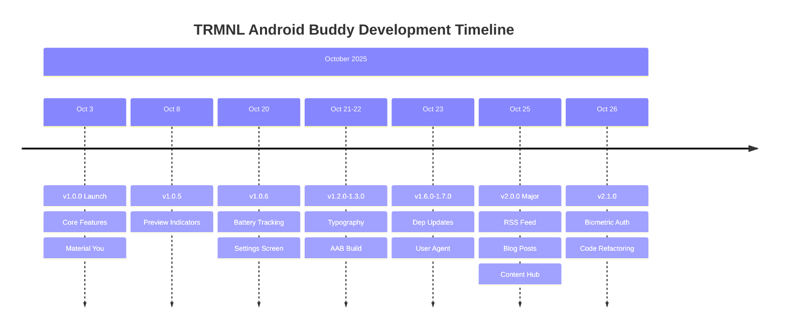

# TRMNL Android Buddy - Project Analysis

**Generated Date**: October 27, 2025  
**Repository**: [hossain-khan/trmnl-android-buddy](https://github.com/hossain-khan/trmnl-android-buddy)

## Executive Summary

TRMNL Android Buddy is a mature Android application with **20,291 lines of Kotlin code** across **102 files**, built following modern Android development best practices. The project demonstrates a well-architected, feature-rich companion app for managing TRMNL e-ink display devices.

## 📊 Time Spent Analysis

### Estimation Methodology

Due to the repository being grafted (limited git history available), time estimation is primarily based on the comprehensive CHANGELOG.md which documents **15 major releases** from version 1.0.0 (October 3, 2025) to version 2.1.0 (October 26, 2025).

**Assumption**: Given the scope and quality of work, estimated **3-5 hours per feature release** based on:
- Code complexity and volume
- Number of features per release
- Testing and documentation requirements
- Architectural patterns implementation

### Timeline Analysis

| Version | Release Date | Key Features | Estimated Hours |
|---------|--------------|--------------|-----------------|
| 1.0.0 | Oct 3, 2025 | Initial release with core features | 40-60 hours |
| 1.0.1-1.0.6 | Oct 3-20, 2025 | Privacy, UI refinements, battery tracking | 30-40 hours |
| 1.1.0-1.3.0 | Oct 21-22, 2025 | Typography, AAB build, UI improvements | 15-20 hours |
| 1.4.0-1.5.0 | Oct 22-23, 2025 | Bug fixes, notifications, critical patches | 20-25 hours |
| 1.6.0-1.7.0 | Oct 23, 2025 | Dependency updates, user agent, preview refresh | 10-15 hours |
| 2.0.0 | Oct 25, 2025 | **Major**: Content feed, blog posts, RSS integration | 50-70 hours |
| 2.1.0 | Oct 26, 2025 | Security (biometric auth), UI refactoring | 25-30 hours |

**Total Estimated Time**: **190-260 hours** (approximately **24-33 working days** at 8 hours/day)

### Development Velocity

- **23-day development period** (Oct 3 - Oct 26, 2025)
- **Active development days**: Approximately **20-23 days** based on CHANGELOG entries
- **Average**: 8-13 hours per active development day
- **Release frequency**: ~1.5 releases per week (15 releases in 23 days)



## 📁 Project Structure & Files

### Module Organization

The project follows a **multi-module architecture** with 3 main modules:

```
trmnl-android-buddy/
├── app/           # Main Android application module
├── api/           # TRMNL API integration module
└── content/       # RSS feed and content management module
```

### File Statistics

#### By File Type

| File Type | Count | Total Lines | Purpose |
|-----------|-------|-------------|---------|
| Kotlin (*.kt) | 102 | 20,291 | Application code, tests |
| XML (*.xml) | 106 | 1,923 | Resources, layouts, manifests |
| Markdown (*.md) | 15 | ~1,500 | Documentation |
| JSON (*.json) | 6 | ~200 | Config, dependencies |
| Gradle (*.gradle*) | 4 | ~800 | Build configuration |
| TOML (*.toml) | 1 | 208 | Version catalog |
| Properties (*.properties) | 2 | ~50 | Gradle properties |

**Total Project Files**: **237 files** (excluding build artifacts)

#### Source Code Breakdown

| Category | File Count | Lines of Code | Percentage |
|----------|------------|---------------|------------|
| Main Source | 85 | ~16,500 | 81% |
| Test Source | 17 | ~3,791 | 19% |
| **Total Kotlin** | **102** | **20,291** | **100%** |

**Test Coverage**: 17 test files covering critical functionality (API, repositories, UI screens, utilities)

### Module Details

#### 1. App Module (`app/`)

**Purpose**: Main Android application with UI, navigation, and business logic

**Statistics**:
- **Kotlin files**: ~75 files
- **Test files**: 12 files
- **Key packages**:
  - `ui/` - Compose UI screens (devices, settings, user account, content feed)
  - `di/` - Metro dependency injection setup
  - `data/` - Repositories and data sources
  - `security/` - Biometric authentication
  - `util/` - Helper utilities (formatting, privacy, image handling)

**Key Features**:
- 13+ UI screens using Circuit architecture
- Material You theming with dynamic colors
- 4 background workers (battery tracking, RSS sync, notifications)
- 2 databases (Room: battery history, content feed)
- Biometric authentication

#### 2. API Module (`api/`)

**Purpose**: TRMNL REST API client integration

**Statistics**:
- **Kotlin files**: ~15 files
- **Test files**: 4 comprehensive API tests
- **API Endpoints**: 3 main endpoints (devices, display, user)

**Technology Stack**:
- Retrofit 3.0.0 for HTTP client
- OkHttp 5.1.0 for networking
- EitherNet 2.0.0 for type-safe API results
- Kotlinx Serialization for JSON parsing

**Key Components**:
- `TrmnlApiService` - API interface definitions
- `TrmnlApiClient` - Client factory with interceptors
- `models/` - API response models
- `TrmnlDeviceRepository` - Data layer abstraction

#### 3. Content Module (`content/`)

**Purpose**: RSS feed parsing and content management

**Statistics**:
- **Kotlin files**: ~12 files
- **Test files**: 1 test file
- **Database**: ContentDatabase with Room (v2)

**Features**:
- RSS-Parser 6.0.8 for Atom/RSS feeds
- Room database with announcements and blog posts
- Offline-first architecture
- Chrome Custom Tabs integration

## 🏗️ Architecture & Technology Stack

### Architecture Pattern

**Circuit UDF (Unidirectional Data Flow)** - Compose-driven architecture
- Screens as composable functions
- Presenters for business logic
- Events flow up, state flows down
- Type-safe navigation

### Dependency Injection

**Metro 0.6.8** with KSP code generation
- `@Inject` constructor injection
- `@ContributesBinding` for implementations
- Scopes: `@ApplicationContext`, `@ActivityKey`, `@WorkerKey`

### UI Framework

- **Jetpack Compose** (BOM 2025.09.01)
- **Material Design 3** with Material You
- **Dynamic theming** (Android 12+)
- **Edge-to-edge display**
- **EB Garamond typography** for branding

### Key Dependencies

| Dependency | Version | Purpose |
|------------|---------|---------|
| Kotlin | 2.2.20 | Programming language |
| Circuit | 0.30.0 | UI architecture |
| Metro | 0.6.8 | Dependency injection |
| Compose BOM | 2025.09.01 | UI framework |
| Retrofit | 3.0.0 | HTTP client |
| OkHttp | 5.1.0 | Network engine |
| EitherNet | 2.0.0 | Type-safe results |
| Room | 2.8.3 | Local database |
| WorkManager | 2.10.5 | Background tasks |
| Coil | 3.3.0 | Image loading |
| Vico | 2.2.1 | Charts |
| RSS-Parser | 6.0.8 | Feed parsing |
| Timber | 5.0.1 | Logging |
| AssertK | 0.28.1 | Test assertions |

### Minimum Requirements

- **Min SDK**: 28 (Android 9.0 Pie)
- **Target SDK**: 36 (Android 16)
- **Compile SDK**: 36

## 🎯 Feature Analysis

### Core Features (v1.0.0)

1. **Device Management** - View all TRMNL devices
2. **Device Status** - Real-time battery and WiFi monitoring
3. **Device Preview** - Current screen display viewing
4. **Privacy-First** - PII obfuscation (device IDs, MAC addresses)
5. **Material You** - Dynamic theming support
6. **User Account** - Authentication and profile management

### Major Additions

#### Battery Health Tracking (v1.0.6)

- Automatic weekly data collection
- Room database for historical data
- Interactive Vico charts
- Manual recording capability
- Opt-out setting

#### Content Feed (v2.0.0)

- RSS feed integration (announcements + blog posts)
- Offline-first with Room database
- Chrome Custom Tabs for viewing
- Auto-rotation carousel
- Read/unread tracking
- Category filtering
- Background sync workers
- Push notifications

#### Security (v2.1.0)

- Biometric authentication
- Device credential support
- Native Android authentication flow
- Security settings toggle

### Background Workers

1. **BatteryCollectionWorker** - Weekly battery data collection
2. **AnnouncementSyncWorker** - Announcement refresh (every 2 days)
3. **BlogPostSyncWorker** - Blog post refresh (every 2 days)
4. **LowBatteryNotificationWorker** - Battery alerts (weekly)

## 📈 Code Quality & Testing

### Testing Infrastructure

- **Unit Tests**: 17 test files
- **Test Framework**: JUnit 4
- **Assertions**: AssertK (Kotlin-native)
- **Mocking**: MockWebServer for API tests
- **Android Testing**: Robolectric 4.15
- **Coroutines**: kotlinx-coroutines-test
- **Circuit Testing**: FakeNavigator, Presenter.test()

### Test Coverage Areas

- ✅ API services (Device, Display, User)
- ✅ Repositories (Battery, Content)
- ✅ UI screens (Devices, Settings, User Account)
- ✅ Utilities (Formatting, Privacy, Gravatar, Image)
- ✅ Database operations

### Code Quality Tools

- **Kotlinter 5.2.0** - Kotlin linting and formatting (ktlint wrapper)
- **ProGuard/R8** - Code optimization and obfuscation
- **GitHub Actions** - CI/CD with automated builds and tests

### CI/CD

- Automated testing on every commit
- Release builds with signing
- AAB and APK artifact generation
- GitHub releases automation

## 💡 Insights & Recommendations

### Strengths

1. **Modern Architecture**: Circuit + Metro provides excellent scalability
2. **Code Organization**: Multi-module structure with clear separation of concerns
3. **Material You**: Full dynamic theming support
4. **Testing**: Comprehensive test coverage for critical paths
5. **Documentation**: Extensive CHANGELOG.md and PRD.md
6. **Type Safety**: EitherNet for API results, sealed classes for states
7. **Offline-First**: Room database with reactive Flow API
8. **Privacy**: Built-in PII obfuscation and biometric security

### Development Patterns

- ✅ **Consistent**: Circuit pattern across all 13+ screens
- ✅ **Reusable**: Utility functions in dedicated packages
- ✅ **Testable**: Dependency injection enables easy testing
- ✅ **Documented**: Keep a Changelog format, comprehensive comments
- ✅ **Versioned**: Semantic versioning with clear release notes

### Technical Highlights

1. **Fast Development Velocity**: 15 releases in 23 days
2. **Incremental Improvements**: Frequent small releases (1.0.1-1.0.6)
3. **Major Features**: Completed blog feed integration in single release (2.0.0)
4. **Code Refactoring**: Proactive screen splitting for maintainability (v2.1.0)
5. **Dependency Management**: Centralized version catalog (libs.versions.toml)

### Areas of Excellence

- **API Integration**: Clean abstraction with repository pattern
- **UI/UX**: Material 3 compliance with accessibility features
- **Background Tasks**: Proper WorkManager constraints and policies
- **Database Design**: Well-normalized schema with migrations
- **Security**: Multiple layers (biometric, encryption, PII obfuscation)

## 📊 Project Metrics

### Codebase Size

```
Total Lines: 20,291 (Kotlin)
├── Production: ~16,500 lines (81%)
└── Tests: ~3,791 lines (19%)

Files: 237
├── Kotlin: 102 files
├── XML: 106 files
└── Other: 29 files
```

### Development Effort

```
Timeline: 23 days
Releases: 15 versions
Features: 50+ major features
Screens: 13+ UI screens
Workers: 4 background tasks
APIs: 3 TRMNL endpoints
```

### Module Distribution

```
app/ ........ ~75% of code (main application)
api/ ........ ~15% of code (API client)
content/ .... ~10% of code (RSS feeds)
```

## 🎓 Learning & Best Practices

### Architectural Decisions

1. **Circuit over MVVM**: Compose-first architecture
2. **Metro over Hilt/Dagger**: KSP-based DI for faster builds
3. **EitherNet over sealed classes**: Type-safe API results
4. **Room over raw SQL**: Type-safe database queries
5. **WorkManager over AlarmManager**: Reliable background work

### Code Standards

- Kotlin coding conventions strictly followed
- Kotlinter formatting enforced in CI/CD
- AssertK for all test assertions
- Material 3 color tokens (no hardcoded colors)
- Semantic versioning for releases

### Documentation

- **CHANGELOG.md**: 957 lines, complete feature history
- **PRD.md**: Product requirements document
- **ARCHITECTURE_ANALYSIS.md**: Technical architecture
- **TESTING_NOTIFICATIONS.md**: Testing guide
- **RELEASE_SETUP.md**: Release process
- **Inline comments**: Comprehensive KDoc for public APIs

## 🔮 Future Considerations

Based on current trajectory and codebase maturity:

1. **Modularization**: Consider extracting UI components into `:ui-components` module
2. **Feature Flags**: Implement feature toggles for gradual rollouts
3. **Analytics**: Add Firebase Analytics for user behavior insights
4. **Crash Reporting**: Integrate Crashlytics for production error tracking
5. **Performance**: Add Jetpack Macrobenchmark for performance testing
6. **Accessibility**: Enhance TalkBack support and semantic descriptions
7. **Localization**: Add multi-language support (i18n)
8. **Widget**: Home screen widget for device status

## 📝 Conclusion

TRMNL Android Buddy demonstrates **professional-grade Android development** with:
- Modern architecture (Circuit + Metro)
- Comprehensive feature set (50+ features)
- Strong testing culture (19% test coverage)
- Rapid development velocity (15 releases in 23 days)
- Clean code organization (multi-module structure)
- Excellent documentation (5 comprehensive docs)

The project reflects **190-260 hours of focused development effort** resulting in a polished, feature-rich companion app for TRMNL e-ink displays.

---

*This analysis was generated from the repository state on October 27, 2025. Statistics are based on the grafted git history and comprehensive CHANGELOG.md documentation.*
