# TRMNL Android Buddy - Project Analysis

**Analysis Date**: November 13, 2025  
**Analysis Period**: October 2, 2025 - November 13, 2025 (43 days)

---

## 📊 Executive Summary

TRMNL Android Buddy is an actively developed Android companion app for TRMNL e-ink displays. The project has seen intensive development over a 43-day period with continuous improvements in code quality, test coverage, and features, maintaining a clean, modern codebase built with Kotlin and Jetpack Compose.

### Key Metrics
- **Total Commits**: 757
- **Total Development Time**: ~84.76 hours
- **Active Days**: 21+ out of 43 days (49%)
- **Development Sessions**: 51 sessions
- **Average Session Duration**: 1.66 hours
- **Contributors**: 2 (1 human developer + 1 AI assistant)
- **Current Version**: 2.6.0 (versionCode 22)

---

## ⏱️ Time Investment Analysis

### Methodology

Time estimation is based on git commit timestamp analysis with the following assumptions:

1. **Session Gap Threshold**: 1 hour
   - If time between commits ≤ 1 hour → same work session (accumulate time)
   - If time between commits > 1 hour → new work session (previous session ended)
2. **Session Duration**: Time from first commit to last commit in a continuous session
3. **Idle Time**: Not counted (gaps > 1 hour are considered breaks/offline)

This heuristic provides a realistic estimate of focused development time. The 1-hour threshold better captures actual coding sessions, as gaps longer than 1 hour typically indicate breaks, context switching, research, or other non-coding activities.

> **Note**: A reusable Python script for calculating development time with configurable thresholds is available at `docs/calculate_dev_time.py`.

### Development Time Breakdown

| Metric | Value |
|--------|-------|
| Total Development Time | **84.76 hours** |
| Total Sessions | 51 |
| Average Session Duration | 1.66 hours |
| Longest Session | 6.69 hours (Oct 2) |
| Total Commits | 757 |

### Top 10 Longest Development Sessions

| Rank | Date | Duration | Time Range | Commits |
|------|------|----------|------------|---------|
| 1 | Oct 2, 2025 | 6.69 hrs | 17:18 - 23:59 | 53 |
| 2 | Oct 24, 2025 | 5.21 hrs | 17:10 - 02:22 | 57 |
| 3 | Oct 24, 2025 | 4.75 hrs | 09:38 - 14:24 | 31 |
| 4 | Oct 25, 2025 | 4.65 hrs | 18:33 - 23:12 | 31 |
| 5 | Oct 25, 2025 | 4.27 hrs | 07:50 - 12:06 | 36 |
| 6 | Oct 23, 2025 | 4.27 hrs | 19:29 - 23:45 | 32 |
| 7 | Nov 4, 2025 | 3.83 hrs | 19:11 - 23:01 | 49 |
| 8 | Oct 3, 2025 | 3.40 hrs | 09:51 - 13:15 | 31 |
| 9 | Nov 2, 2025 | 3.32 hrs | 18:28 - 21:48 | 29 |
| 10 | Oct 23, 2025 | 3.12 hrs | 02:04 - 01:12 | 35 |

**Insight**: The project shows a classic sprint pattern with intensive development bursts (Oct 24-26, Nov 4), likely corresponding to major feature implementations and release preparation.

---

## 📁 Project Structure & File Analysis

### Codebase Statistics

Generated using file counts and project inspection:

| Language | Files | Description |
|----------|-------|-------------|
| **Kotlin** | 147 | Application code, tests, and repositories |
| **XML** | 129 | Android resources, layouts, and configurations |
| **Markdown** | 16 | Documentation files |
| **YAML** | 5+ | GitHub Actions workflows and configurations |
| **JSON** | 6+ | Configuration and data files |
| **Gradle** | 5+ | Build configuration files |

### Code Quality Metrics

- **Test Coverage**: ~85% for API module (improved from ~60%)
- **Total Test Files**: 45+ comprehensive test files
- **Kotlin Focus**: Primary language for all business logic
- **Documentation**: Extensive with comprehensive Markdown documentation
- **CI/CD**: GitHub Actions with automated testing and code coverage reporting
- **Code Coverage Tools**: Kotlinx Kover 0.9.1 with Codecov.io integration

### File Type Distribution


### Key Directories

```
trmnl-android-buddy/
├── app/                          # Main Android application (101 .kt files)
│   ├── src/main/                 # Production code
│   │   ├── java/ink/trmnl/android/buddy/
│   │   │   ├── ui/               # Jetpack Compose UI screens
│   │   │   ├── data/             # Repositories, DAOs, entities
│   │   │   ├── di/               # Dependency injection
│   │   │   ├── security/         # Biometric authentication
│   │   │   ├── util/             # Utility functions
│   │   │   └── work/             # Background workers
│   │   └── res/                  # Android resources (104 XML files)
│   └── src/test/                 # Unit tests (14 .kt test files)
├── api/                          # TRMNL API integration module
│   └── src/
│       ├── main/                 # API client, models, repositories
│       └── test/                 # API tests with MockWebServer
├── content/                      # Content feed module (RSS, announcements, blogs)
│   └── src/
│       ├── main/                 # Content repositories, DAOs
│       └── test/                 # Content module tests
├── docs/                         # Project documentation (16 Markdown files)
├── gradle/                       # Gradle configuration & dependency versions
├── keystore/                     # Debug keystore & signing documentation
└── project-resources/            # Screenshots, icons, graphics (SVG, PNG)
```

---

## 👥 Contributor Analysis

### Contributors

| Contributor | Commits | Percentage | Type |
|-------------|---------|------------|------|
| Hossain Khan | 522 | 88.0% | Human Developer |
| copilot-swe-agent[bot] | 71 | 12.0% | AI Assistant |

### Development Pattern

The project demonstrates a **hybrid development approach**:
- **Primary Development**: Human developer (Hossain Khan) handles architecture, critical features, and final implementation
- **AI-Assisted Development**: GitHub Copilot assists with code generation, refactoring, and documentation (65 commits)
- **Collaboration**: Human reviews and integrates AI suggestions, maintaining code quality

---

## 🚀 Development Milestones

### Version History

| Version | Date | Major Features |
|---------|------|----------------|
| **2.6.0** | Nov 12, 2025 | Test coverage improvements (~85% API module), Kover integration, Codecov.io, Battery alerts, Test analytics |
| **2.5.0** | Nov 8, 2025 | Recipe descriptions, Haptic feedback, Content Hub in settings |
| **2.4.0** | Nov 4, 2025 | Pinch to zoom, Smart icon inverter, Recipe bookmarks, Recipes catalog, Device catalog |
| **2.3.0** | Nov 1, 2025 | Content hub badges, Welcome screen button updates, Settings enhancements |
| **2.2.1** | Nov 1, 2025 | Content carousel bug fix, unused code cleanup |
| **2.2.0** | Oct 31, 2025 | Access token banner, PRD documentation |
| **2.1.0** | Oct 26, 2025 | Security (biometric auth), Settings UI improvements, Material You compliance |
| **2.0.0** | Oct 25, 2025 | Combined content carousel, Background sync optimization |
| **1.7.0** | Oct 24, 2025 | Battery history tracking with charts |
| **1.6.0** | Oct 23, 2025 | RSS feed content integration |
| **1.5.0** | Oct 22, 2025 | Content feed repository architecture |
| Earlier | Oct 2-21 | Foundation, API integration, core features |

### Timeline Graph

```mermaid
timeline
    title TRMNL Android Buddy Development Timeline
    
    Oct 2, 2025 : Project Initialization
                : Initial Setup (14 commits)
                : Gradle configuration
                : Circuit architecture
    
    Oct 3, 2025 : Core Architecture (69 commits)
                : Metro DI integration
                : API client setup
                : Basic UI screens
                : 🚀 v1.0.0 - Initial release
                : 🚀 v1.0.1 - Bug fixes
                : 🚀 v1.0.2 - Privacy toggle
                : 🚀 v1.0.3 - UI enhancements
    
    Oct 4, 2025 : Feature Development (24 commits)
                : Device monitoring
                : Battery tracking
                : 🚀 v1.0.4 - Code quality
    
    Oct 8, 2025 : API Integration (8 commits)
                : TRMNL API endpoints
                : Device repository
                : 🚀 v1.0.5 - Refresh rate indicator
    
    Oct 20, 2025 : Settings & UX (18 commits)
                 : Settings screen enhancements
                 : Battery management
                 : 🚀 v1.0.6 - Settings improvements
    
    Oct 21, 2025 : Branding & CI/CD (34 commits)
                 : TRMNL branding
                 : Typography enhancements
                 : AAB support
                 : 🚀 v1.1.0 - AAB & CI/CD
                 : 🚀 v1.2.0 - Branding updates
    
    Oct 22, 2025 : Feed Architecture (38 commits)
                 : Content repository
                 : Button UX improvements
                 : 🚀 v1.3.0 - Button UX
                 : 🚀 v1.4.0 - UI improvements
    
    Oct 23, 2025 : Content & Notifications (57 commits)
                 : RSS feed integration
                 : Low battery alerts
                 : Dependency updates
                 : 🚀 v1.5.0 - Battery notifications
                 : 🚀 v1.6.0 - Dependencies
                 : 🚀 v1.7.0 - Refresh & User Agent
    
    Oct 24, 2025 : Security Sprint (93 commits)
                 : Biometric authentication
                 : Security settings
                 : Battery history charts
    
    Oct 25, 2025 : Major Releases (85 commits)
                 : Material You fixes
                 : Content carousel
                 : Background sync optimization
                 : 🚀 v2.0.0 - Major feature release
                 : 🚀 v2.1.0 - Security & UI enhancements
    
    Oct 26, 2025 : Documentation (19 commits)
                 : README updates
                 : Screenshots
                 : PRD document
    
    Oct 31, 2025 : Release & Documentation (22 commits)
                 : Access token banner
                 : Refactoring
                 : 🚀 v2.2.0 - Documentation release
    
    Nov 1, 2025 : Bug Fixes (12 commits)
               : Content carousel fixes
               : Code cleanup
               : 🚀 v2.2.1 - Bug fix release
               : Settings enhancements
               : 🚀 v2.3.0 - Content hub badges
    
    Nov 4, 2025 : Major Feature Release (32+ commits)
               : Recipes Catalog with search & bookmarks
               : Device Catalog with 17 models
               : Pinch to zoom (Telephoto)
               : Smart icon inverter (dark mode)
               : 🚀 v2.4.0 - Major feature release
               : PRD documentation updates
    
    Nov 8, 2025 : UX Enhancements
                : Recipe descriptions in catalog
                : Haptic feedback for bookmarks
                : Content Hub in Settings
                : Recipe parsing fixes
                : 🚀 v2.5.0 - UX improvements
    
    Nov 12, 2025 : Quality & Testing Sprint
                 : Comprehensive test coverage (~85% API)
                 : Kover integration for code coverage
                 : Codecov.io integration
                 : Battery alert indicators
                 : Test analytics and CI improvements
                 : 🚀 v2.6.0 - Quality improvements
```



---

## 📈 Insights & Patterns

### 1. Development Velocity

**Consistent Progress**:
- The project maintains steady development pace with regular releases
- Version progression from 1.0.0 to 2.6.0 over 43 days
- Focus on both feature development and quality improvements
- Recent emphasis on testing and code coverage (v2.6.0)

**Quality-Focused Development**:
- Comprehensive test coverage improvements (~85% for API module)
- Integration of modern tooling (Kover, Codecov.io)
- Continuous refactoring and code organization
- Balanced approach between features and quality

### 2. Code Quality Indicators

**Positive Signals**:
- ✅ **High Test Coverage**: ~85% for API module with comprehensive test suite
- ✅ **Code Coverage Tracking**: Kover integration with Codecov.io reporting
- ✅ **Test Analytics**: CI reliability tracking with Codecov Test Analytics
- ✅ **Modular Architecture**: Separate modules (app, api, content)
- ✅ **Modern Stack**: Kotlin, Compose, Circuit, Metro DI
- ✅ **Type Safety**: EitherNet for API error handling
- ✅ **Comprehensive Documentation**: 16+ Markdown files

**Technical Debt Management**:
- Regular refactoring commits (split screens, modularization)
- Code review via PRs with automated quality checks
- CI/CD with GitHub Actions and coverage reporting
- Consistent code formatting with Kotlinter plugin

### 3. Feature Development Pattern

**Iterative Approach**:
1. **Foundation** (Oct 2-5): Core architecture, API integration
2. **Features** (Oct 8-21): Device monitoring, content feeds
3. **Polish** (Oct 22-25): UI improvements, security, optimization
4. **Release** (Oct 25-26): v2.1.0 release, documentation
5. **Maintenance** (Oct 31-Nov 1): Bug fixes, enhancements
6. **Innovation** (Nov 4-8): Recipes catalog, device catalog, zoom features
7. **Quality** (Nov 12): Test coverage, code quality tools

**Material You Compliance**:
- Complete adherence to Material 3 design system
- Dynamic color theming support
- Theme-aware components throughout
- Accessibility considerations

### 4. Technology Choices

**Modern Android Stack**:
- **UI**: Jetpack Compose (declarative UI)
- **Architecture**: Circuit (Slack's UDF architecture)
- **DI**: Metro with KSP (compile-time safety)
- **Network**: Retrofit 3.0 + OkHttp 5.1 + EitherNet
- **Async**: Kotlinx Coroutines
- **Storage**: Room + DataStore
- **Testing**: MockWebServer, Robolectric, AssertK
- **Coverage**: Kotlinx Kover 0.9.1

**Benefits**:
- Type-safe navigation and state management
- Compile-time dependency injection
- Modern, maintainable codebase
- Comprehensive testing capabilities
- Automated code coverage reporting

### 5. AI-Assisted Development

**Copilot Integration**:
- Code generation and refactoring assistance
- Documentation creation and updates
- UI component development
- Test generation support
- Consistent with modern development practices

**Impact**:
- Accelerated development velocity
- Consistent code patterns
- Comprehensive documentation
- Quality maintenance

### 6. Release Cadence

**Regular Iteration**:
- v1.0.0 to v2.6.0 over 43 days
- 14+ minor/major versions released
- Semantic versioning consistently followed
- Detailed CHANGELOG.md maintenance with Keep a Changelog format
- Recent focus on quality and testing infrastructure

---

## 🎯 Key Achievements

### Technical
1. ✅ **Modern Architecture**: Circuit + Metro + Compose
2. ✅ **Modular Design**: Separate API and content modules
3. ✅ **Type Safety**: EitherNet for API results, sealed classes
4. ✅ **Testing**: Comprehensive unit tests with ~85% API module coverage
5. ✅ **Material You**: Full compliance with Material 3 design system
6. ✅ **Code Coverage**: Kover integration with Codecov.io reporting
7. ✅ **CI/CD**: GitHub Actions with automated testing and analytics

### Features
1. ✅ **Device Monitoring**: Real-time battery and WiFi tracking with preview zoom
2. ✅ **Battery Health Tracking**: Charts with weekly data collection and Vico visualization
3. ✅ **Battery Alerts**: Visual indicators and notifications for low battery
4. ✅ **Content Feed**: Combined announcements & blog posts with carousel
5. ✅ **Security**: Biometric/credential authentication
6. ✅ **Background Sync**: Optimized workers with constraints
7. ✅ **Recipes Catalog**: Browse, search, and bookmark TRMNL plugin recipes
8. ✅ **Device Catalog**: View specifications for 17 supported e-ink devices
9. ✅ **Pinch to Zoom**: 4x zoom on device preview images with Telephoto library
10. ✅ **Smart Icon Inverter**: Auto-detects and inverts dark icons in dark mode
11. ✅ **Battery History Management**: Clear stale data with charging event detection

### User Experience
1. ✅ **Dynamic Theming**: Material You with wallpaper-based colors
2. ✅ **Dark Mode**: Full support with proper theme colors
3. ✅ **Privacy**: Obfuscated sensitive data with toggle
4. ✅ **Accessibility**: Proper content descriptions, semantic markup
5. ✅ **Haptic Feedback**: Tactile confirmation for bookmarks and interactions
6. ✅ **Auto-scroll Charts**: Battery history automatically shows latest data

---

## 📊 Statistical Summary

### Code Metrics
- **Kotlin Files**: 147+ files
- **XML Resources**: 129+ files
- **Markdown Documentation**: 16+ files
- **Test Files**: 45+ comprehensive test files

### Development Metrics
- **Duration**: 43 days (October 2 - November 13, 2025)
- **Total Commits**: 757
- **Total Development Time**: ~84.76 hours
- **Active Days**: 21+ out of 43 days (49%)
- **Development Sessions**: 51 sessions
- **Average Session Duration**: 1.66 hours
- **Current Version**: 2.6.0 (versionCode 22)
- **Major Versions Released**: 14+ versions (1.0.0 to 2.6.0)
- **Release Cadence**: Frequent iterative releases with continuous improvements

### Quality Metrics
- **Test Coverage**: ~85% for API module (improved from ~60%)
- **Code Coverage Tool**: Kotlinx Kover 0.9.1
- **Coverage Platform**: Codecov.io with Test Analytics
- **Test Files**: 45+ comprehensive test files
- **Modules**: 3 (app, api, content)
- **CI/CD**: GitHub Actions (passing with coverage reporting)

---

## 🔮 Observations & Recommendations

### Strengths
1. **High Code Quality**: Comprehensive test coverage (~85% API module) with continuous improvements
2. **Modern Stack**: Using latest Android best practices with Kotlin, Compose, Circuit
3. **Documentation**: Comprehensive CHANGELOG, README, and technical documentation
4. **Testing Infrastructure**: Robust testing with Kover, Codecov.io, and Test Analytics
5. **AI Integration**: Effective use of Copilot for productivity and code quality
6. **Code Coverage**: Integrated coverage reporting with trend tracking

### Recent Improvements (v2.5.0 - v2.6.0)
1. **Test Coverage**: Significant increase from ~60% to ~85% for API module
2. **Quality Tools**: Added Kover for coverage and Codecov.io for tracking
3. **Test Analytics**: Implemented Codecov Test Analytics for CI reliability
4. **Battery Features**: Added alert indicators and history management
5. **Content Module**: Comprehensive test coverage expansion

### Potential Areas for Enhancement
1. **UI Testing**: Consider expanding Compose UI test coverage
2. **Integration Tests**: End-to-end testing for critical user flows
3. **Performance Monitoring**: Consider Firebase Performance or similar tools
4. **Analytics**: User behavior tracking (privacy-respecting approach)
5. **Crash Reporting**: Firebase Crashlytics or Sentry integration

### Development Process Excellence
1. **PR-Based Workflow**: All changes via pull requests
2. **Semantic Versioning**: Consistent version numbering
3. **CHANGELOG**: Well-maintained release notes following Keep a Changelog
4. **Code Review**: Human + AI collaboration
5. **Quality Gates**: Format, lint, test before commit
6. **Coverage Tracking**: Automated coverage reporting and trend analysis

---

## 📝 Conclusion

TRMNL Android Buddy represents a modern, well-architected Android application developed with impressive velocity and consistently high quality. The project demonstrates:

- **Professional Development Practices**: PR-based workflow, CI/CD, semantic versioning, comprehensive testing
- **Modern Architecture**: Circuit, Metro DI, Jetpack Compose with Material You compliance
- **Rapid Iteration**: 757 commits over 43 days (~84.76 hours of focused development)
- **Quality Focus**: ~85% test coverage for API module, integrated code coverage tracking with Kover and Codecov.io
- **Continuous Improvement**: Active development over 43 days with 51 sessions averaging 1.66 hours each
- **Testing Excellence**: Comprehensive test suite with analytics for reliability tracking
- **Innovative Approach**: Human + AI collaboration for accelerated development while maintaining quality
- **Rich Feature Set**: Device monitoring, battery tracking with alerts, content feeds, recipe catalog, zoom capabilities, and smart theming

The project is actively maintained, well-documented, and follows Android best practices. The recent focus on test coverage and quality tooling (v2.6.0) demonstrates commitment to long-term maintainability. The hybrid development approach with AI assistance has proven effective in maintaining high velocity while continuously improving code quality and test coverage.

---

**Generated**: November 13, 2025  
**Analysis Methodology**: Git repository inspection, CHANGELOG analysis, file statistics, Python-based time calculation script  
**Data Source**: Git repository history (Oct 2 - Nov 13, 2025)  
**Previous Analysis**: November 4, 2025
