# TRMNL Android Buddy - Project Analysis

**Analysis Date**: November 4, 2025  
**Analysis Period**: October 2, 2025 - November 4, 2025 (34 days)

---

## 📊 Executive Summary

TRMNL Android Buddy is an actively developed Android companion app for TRMNL e-ink displays. The project has seen intensive development over a 34-day period with **693 total commits**, **79.57 hours** of estimated development time, and a clean, modern codebase built with Kotlin and Jetpack Compose.

### Key Metrics
- **Total Commits**: 693
- **Total Development Time**: ~79.57 hours
- **Active Days**: 20+ out of 34 days (59%)
- **Development Sessions**: 46 sessions
- **Average Session Duration**: 1.73 hours
- **Contributors**: 2 (1 human developer + 1 AI assistant)
- **Current Version**: 2.4.0 (versionCode 20)

---

## ⏱️ Time Investment Analysis

### Methodology

Time estimation is based on git commit timestamp analysis with the following assumptions:

1. **Session Gap Threshold**: 1 hour
   - If time between commits ≤ 1 hour → same work session (accumulate time)
   - If time between commits > 1 hour → new work session (previous session ended)
2. **Session Duration**: Time from first commit to last commit in a continuous session
3. **Idle Time**: Not counted (gaps > 1 hour are considered breaks/offline)

This heuristic provides a realistic estimate of focused development time. The 1-hour threshold better captures actual coding sessions, as gaps longer than 1 hour typically indicate breaks, context switching, research, or other non-coding activities.

> **Note**: A reusable Python script for calculating development time with configurable thresholds is available at `docs/calculate_dev_time.py`.

### Development Time Breakdown

| Metric | Value |
|--------|-------|
| Total Development Time | **79.57 hours** |
| Total Sessions | 46 |
| Average Session Duration | 1.73 hours |
| Longest Session | 6.69 hours (Oct 2) |
| Shortest Session | 0.01 hours |

### Top 10 Longest Development Sessions

| Rank | Date | Duration | Time Range | Commits |
|------|------|----------|------------|---------|
| 1 | Oct 2, 2025 | 6.69 hrs | 17:18 - 23:59 | 53 |
| 2 | Oct 24, 2025 | 5.21 hrs | 17:10 - 02:22 | 57 |
| 3 | Oct 24, 2025 | 4.75 hrs | 09:38 - 14:24 | 31 |
| 4 | Oct 25, 2025 | 4.65 hrs | 18:33 - 23:12 | 31 |
| 5 | Oct 25, 2025 | 4.27 hrs | 07:50 - 12:06 | 36 |
| 6 | Oct 23, 2025 | 4.27 hrs | 19:29 - 23:45 | 32 |
| 7 | Oct 3, 2025 | 3.40 hrs | 09:51 - 13:15 | 31 |
| 8 | Nov 4, 2025 | 3.35 hrs | 19:11 - 22:32 | 42 |
| 9 | Nov 2, 2025 | 3.32 hrs | 18:28 - 21:48 | 29 |
| 10 | Oct 23, 2025 | 3.12 hrs | 02:04 - 01:12 | 35 |

### Daily Activity Distribution


### Commit Distribution

| Date | Commits | % of Total |
|------|---------|-----------|
| Oct 24, 2025 | 93 | 13.4% |
| Oct 25, 2025 | 85 | 12.3% |
| Oct 3, 2025 | 69 | 10.0% |
| Oct 23, 2025 | 57 | 8.2% |
| Nov 4, 2025 | 42 | 6.1% |
| Oct 22, 2025 | 38 | 5.5% |
| Oct 21, 2025 | 34 | 4.9% |
| Nov 2, 2025 | 29 | 4.2% |
| Oct 4, 2025 | 24 | 3.5% |
| Oct 26, 2025 | 19 | 2.7% |
| Oct 20, 2025 | 18 | 2.6% |
| Oct 19, 2025 | 15 | 2.2% |
| Nov 1, 2025 | 12 | 1.7% |
| Others | 158 | 22.8% |

**Insight**: The project shows a classic sprint pattern with intensive development bursts (Oct 24-26, Nov 4), likely corresponding to major feature implementations and release preparation.

---

## 📁 Project Structure & File Analysis

### Codebase Statistics

Generated using `cloc` (Count Lines of Code):

| Language | Files | Blank Lines | Comments | Code | Total Lines |
|----------|-------|-------------|----------|------|-------------|
| **Kotlin** | 101 | 1,752 | 2,926 | 15,352 | 20,030 |
| **Markdown** | 16 | 1,276 | 0 | 5,115 | 6,391 |
| **XML** | 104 | 171 | 53 | 1,699 | 1,923 |
| **YAML** | 5 | 103 | 66 | 1,394 | 1,563 |
| **HTML** | 1 | 72 | 9 | 1,046 | 1,127 |
| **JSON** | 6 | 0 | 0 | 792 | 792 |
| **Gradle** | 5 | 63 | 61 | 267 | 391 |
| **SVG** | 13 | 0 | 1 | 145 | 146 |
| **Python** | 1 | 34 | 30 | 107 | 171 |
| **Other** | 13 | 108 | 257 | 336 | 701 |
| **TOTAL** | **265** | **3,579** | **3,403** | **26,253** | **33,235** |

### Code Quality Metrics

- **Comment Density**: 13.0% (3,403 comments / 26,253 code lines)
- **Kotlin Focus**: 58.5% of total code (15,352 / 26,253)
- **Documentation**: Extensive with 5,115 lines of Markdown
- **XML Resources**: 104 files for Android UI/resources

### File Type Distribution


### Key Directories

```
trmnl-android-buddy/
├── app/                          # Main Android application (101 .kt files)
│   ├── src/main/                 # Production code
│   │   ├── java/ink/trmnl/android/buddy/
│   │   │   ├── ui/               # Jetpack Compose UI screens
│   │   │   ├── data/             # Repositories, DAOs, entities
│   │   │   ├── di/               # Dependency injection
│   │   │   ├── security/         # Biometric authentication
│   │   │   ├── util/             # Utility functions
│   │   │   └── work/             # Background workers
│   │   └── res/                  # Android resources (104 XML files)
│   └── src/test/                 # Unit tests (14 .kt test files)
├── api/                          # TRMNL API integration module
│   └── src/
│       ├── main/                 # API client, models, repositories
│       └── test/                 # API tests with MockWebServer
├── content/                      # Content feed module (RSS, announcements, blogs)
│   └── src/
│       ├── main/                 # Content repositories, DAOs
│       └── test/                 # Content module tests
├── docs/                         # Project documentation (16 Markdown files)
├── gradle/                       # Gradle configuration & dependency versions
├── keystore/                     # Debug keystore & signing documentation
└── project-resources/            # Screenshots, icons, graphics (SVG, PNG)
```

---

## 👥 Contributor Analysis

### Contributors

| Contributor | Commits | Percentage | Type |
|-------------|---------|------------|------|
| Hossain Khan | 522 | 88.0% | Human Developer |
| copilot-swe-agent[bot] | 71 | 12.0% | AI Assistant |

### Development Pattern

The project demonstrates a **hybrid development approach**:
- **Primary Development**: Human developer (Hossain Khan) handles architecture, critical features, and final implementation
- **AI-Assisted Development**: GitHub Copilot assists with code generation, refactoring, and documentation (65 commits)
- **Collaboration**: Human reviews and integrates AI suggestions, maintaining code quality

---

## 🚀 Development Milestones

### Version History

| Version | Date | Major Features |
|---------|------|----------------|
| **2.4.0** | Nov 4, 2025 | Pinch to zoom, Smart icon inverter, Recipe bookmarks, Recipes catalog, Device catalog |
| **2.3.0** | Nov 1, 2025 | Content hub badges, Welcome screen button updates, Settings enhancements |
| **2.2.1** | Nov 1, 2025 | Content carousel bug fix, unused code cleanup |
| **2.2.0** | Oct 31, 2025 | Access token banner, PRD documentation |
| **2.1.0** | Oct 26, 2025 | Security (biometric auth), Settings UI improvements, Material You compliance |
| **2.0.0** | Oct 25, 2025 | Combined content carousel, Background sync optimization |
| **1.7.0** | Oct 24, 2025 | Battery history tracking with charts |
| **1.6.0** | Oct 23, 2025 | RSS feed content integration |
| **1.5.0** | Oct 22, 2025 | Content feed repository architecture |
| Earlier | Oct 2-21 | Foundation, API integration, core features |

### Timeline Graph

```mermaid
timeline
    title TRMNL Android Buddy Development Timeline
    
    Oct 2, 2025 : Project Initialization
                : Initial Setup (14 commits)
                : Gradle configuration
                : Circuit architecture
    
    Oct 3, 2025 : Core Architecture (69 commits)
                : Metro DI integration
                : API client setup
                : Basic UI screens
                : 🚀 v1.0.0 - Initial release
                : 🚀 v1.0.1 - Bug fixes
                : 🚀 v1.0.2 - Privacy toggle
                : 🚀 v1.0.3 - UI enhancements
    
    Oct 4, 2025 : Feature Development (24 commits)
                : Device monitoring
                : Battery tracking
                : 🚀 v1.0.4 - Code quality
    
    Oct 8, 2025 : API Integration (8 commits)
                : TRMNL API endpoints
                : Device repository
                : 🚀 v1.0.5 - Refresh rate indicator
    
    Oct 20, 2025 : Settings & UX (18 commits)
                 : Settings screen enhancements
                 : Battery management
                 : 🚀 v1.0.6 - Settings improvements
    
    Oct 21, 2025 : Branding & CI/CD (34 commits)
                 : TRMNL branding
                 : Typography enhancements
                 : AAB support
                 : 🚀 v1.1.0 - AAB & CI/CD
                 : 🚀 v1.2.0 - Branding updates
    
    Oct 22, 2025 : Feed Architecture (38 commits)
                 : Content repository
                 : Button UX improvements
                 : 🚀 v1.3.0 - Button UX
                 : 🚀 v1.4.0 - UI improvements
    
    Oct 23, 2025 : Content & Notifications (57 commits)
                 : RSS feed integration
                 : Low battery alerts
                 : Dependency updates
                 : 🚀 v1.5.0 - Battery notifications
                 : 🚀 v1.6.0 - Dependencies
                 : 🚀 v1.7.0 - Refresh & User Agent
    
    Oct 24, 2025 : Security Sprint (93 commits)
                 : Biometric authentication
                 : Security settings
                 : Battery history charts
    
    Oct 25, 2025 : Major Releases (85 commits)
                 : Material You fixes
                 : Content carousel
                 : Background sync optimization
                 : 🚀 v2.0.0 - Major feature release
                 : 🚀 v2.1.0 - Security & UI enhancements
    
    Oct 26, 2025 : Documentation (19 commits)
                 : README updates
                 : Screenshots
                 : PRD document
    
    Oct 31, 2025 : Release & Documentation (22 commits)
                 : Access token banner
                 : Refactoring
                 : 🚀 v2.2.0 - Documentation release
    
    Nov 1, 2025 : Bug Fixes (12 commits)
               : Content carousel fixes
               : Code cleanup
               : 🚀 v2.2.1 - Bug fix release
               : Settings enhancements
               : 🚀 v2.3.0 - Content hub badges
    
    Nov 4, 2025 : Major Feature Release (32+ commits)
               : Recipes Catalog with search & bookmarks
               : Device Catalog with 17 models
               : Pinch to zoom (Telephoto)
               : Smart icon inverter (dark mode)
               : 🚀 v2.4.0 - Major feature release
               : PRD documentation updates
```



---

## 📈 Insights & Patterns

### 1. Development Velocity

**High-Intensity Sprints**:
- The project shows clear sprint patterns with peak activity days:
  - **Oct 24**: 93 commits (Security & UX sprint)
  - **Oct 25**: 85 commits (Release preparation)
  - **Oct 3**: 69 commits (Core architecture)
  - **Oct 31**: 22 commits (Documentation release)

**Sustainable Pace**:
- 18 active development days over 31-day period
- Average of 33 commits per active day
- Average session duration of ~4 hours

### 2. Code Quality Indicators

**Positive Signals**:
- ✅ **High Comment Density**: 13.0% indicates well-documented code
- ✅ **Test Coverage**: 14 dedicated test files
- ✅ **Modular Architecture**: Separate modules (app, api, content)
- ✅ **Modern Stack**: Kotlin, Compose, Circuit, Metro DI
- ✅ **Type Safety**: EitherNet for API error handling

**Technical Debt Management**:
- Regular refactoring commits (split screens, modularization)
- Code review via PRs (182+ pull requests)
- CI/CD with GitHub Actions

### 3. Feature Development Pattern

**Iterative Approach**:
1. **Foundation** (Oct 2-5): Core architecture, API integration
2. **Features** (Oct 8-21): Device monitoring, content feeds
3. **Polish** (Oct 22-25): UI improvements, security, optimization
4. **Release** (Oct 25-26): v2.1.0 release, documentation
5. **Maintenance** (Oct 31-Nov 1): v2.2.0 & v2.2.1 releases, bug fixes

**Material You Compliance**:
- Recent focus on Material 3 design system
- Dynamic color theming support
- Theme-aware components

### 4. Technology Choices

**Modern Android Stack**:
- **UI**: Jetpack Compose (declarative UI)
- **Architecture**: Circuit (Slack's UDF architecture)
- **DI**: Metro with KSP (compile-time safety)
- **Network**: Retrofit 3.0 + OkHttp 5.1 + EitherNet
- **Async**: Kotlinx Coroutines
- **Storage**: Room + DataStore

**Benefits**:
- Type-safe navigation and state management
- Compile-time dependency injection
- Modern, maintainable codebase

### 5. AI-Assisted Development

**Copilot Integration** (65 commits):
- Code generation and refactoring
- Documentation (PRD, analysis)
- UI component splitting
- Consistent with modern development practices

**Impact**:
- Accelerated development velocity
- Consistent code patterns
- Comprehensive documentation

### 6. Release Cadence

**Rapid Iteration**:
- v1.0.0 to v2.2.1 in 31 days
- 12+ minor/major versions
- Semantic versioning followed
- Detailed CHANGELOG.md maintenance

---

## 🎯 Key Achievements

### Technical
1. ✅ **Modern Architecture**: Circuit + Metro + Compose
2. ✅ **Modular Design**: Separate API and content modules
3. ✅ **Type Safety**: EitherNet for API results, sealed classes
4. ✅ **Testing**: Unit tests with MockWebServer, fakes, Circuit test utilities
5. ✅ **Material You**: Full compliance with Material 3 design system

### Features
1. ✅ **Device Monitoring**: Real-time battery and WiFi tracking with preview zoom
2. ✅ **Battery History**: Charts with weekly data collection and Vico visualization
3. ✅ **Content Feed**: Combined announcements & blog posts with carousel
4. ✅ **Security**: Biometric/credential authentication
5. ✅ **Background Sync**: Optimized workers with constraints
6. ✅ **Recipes Catalog**: Browse, search, and bookmark TRMNL plugin recipes
7. ✅ **Device Catalog**: View specifications for 17 supported e-ink devices
8. ✅ **Pinch to Zoom**: 4x zoom on device preview images with Telephoto library
9. ✅ **Smart Icon Inverter**: Auto-detects and inverts dark icons in dark mode

### User Experience
1. ✅ **Dynamic Theming**: Material You with wallpaper-based colors
2. ✅ **Dark Mode**: Full support with proper theme colors
3. ✅ **Privacy**: Obfuscated sensitive data with toggle
4. ✅ **Accessibility**: Proper content descriptions, semantic markup

---

## 📊 Statistical Summary

### Code Metrics
- **Total Lines**: 33,235+
- **Production Code**: 15,352+ lines (Kotlin)
- **Documentation**: 5,115+ lines (Markdown)
- **Resources**: 1,699+ lines (XML)
- **Files**: 265+ files

### Development Metrics
- **Duration**: 34 days
- **Active Days**: 20+ days (59%)
- **Total Commits**: 693
- **Development Time**: 79.57 hours
- **Average Daily Commits**: 34.7 (on active days)
- **Peak Day**: 93 commits (Oct 24)

### Quality Metrics
- **Comment Ratio**: 13.0%
- **Test Files**: 14+ files
- **Modules**: 3 (app, api, content)
- **CI/CD**: GitHub Actions (passing)

---

## 🔮 Observations & Recommendations

### Strengths
1. **Rapid Development**: High velocity without compromising quality
2. **Modern Stack**: Using latest Android best practices
3. **Documentation**: Comprehensive CHANGELOG and README
4. **Testing**: Unit tests for critical components
5. **AI Integration**: Effective use of Copilot for productivity

### Potential Areas for Enhancement
1. **UI Testing**: Consider adding Compose UI tests
2. **Integration Tests**: End-to-end testing for critical flows
3. **Performance Monitoring**: Firebase Performance or similar
4. **Analytics**: User behavior tracking (privacy-respecting)
5. **Crash Reporting**: Firebase Crashlytics or Sentry

### Development Process Excellence
1. **PR-Based Workflow**: All changes via pull requests
2. **Semantic Versioning**: Consistent version numbering
3. **CHANGELOG**: Well-maintained release notes
4. **Code Review**: Human + AI collaboration
5. **Quality Gates**: Format, lint, test before commit

---

## 📝 Conclusion

TRMNL Android Buddy represents a modern, well-architected Android application developed with impressive velocity and quality. The project demonstrates:

- **Professional Development Practices**: PR-based workflow, CI/CD, semantic versioning
- **Modern Architecture**: Circuit, Metro DI, Jetpack Compose
- **Rapid Iteration**: 693 commits over 34 days (~79.57 hours)
- **Quality Focus**: 13.0% comment density, comprehensive documentation
- **Innovative Approach**: Human + AI collaboration for accelerated development
- **Rich Feature Set**: Device monitoring, battery tracking, content feeds, recipe catalog, zoom capabilities

The project is actively maintained, well-documented, and follows Android best practices. The hybrid development approach with AI assistance has proven effective in maintaining high velocity while preserving code quality. Recent additions like the Recipes Catalog, Device Catalog, and pinch-to-zoom functionality demonstrate continued innovation and user-focused development.

---

**Generated**: November 4, 2025  
**Analysis Tool**: Git log analysis + cloc  
**Methodology**: 1-hour gap heuristic for time estimation  
**Data Source**: Git repository history (Oct 2 - Nov 4, 2025)
